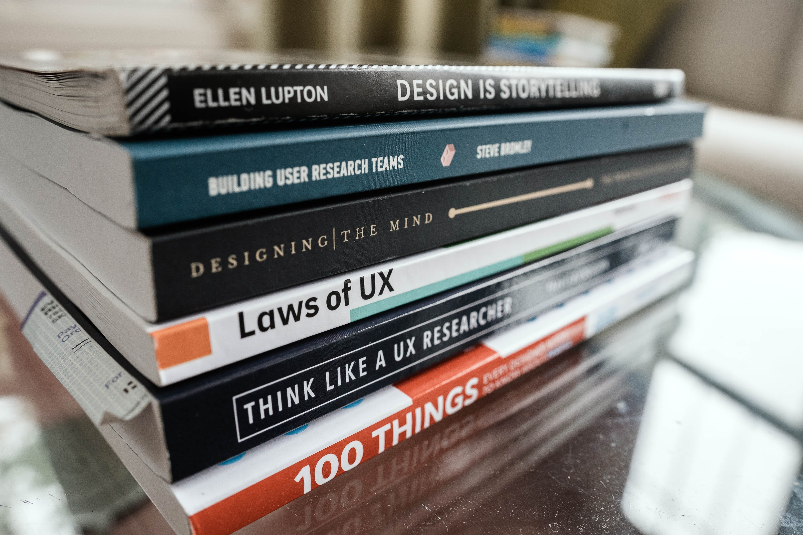
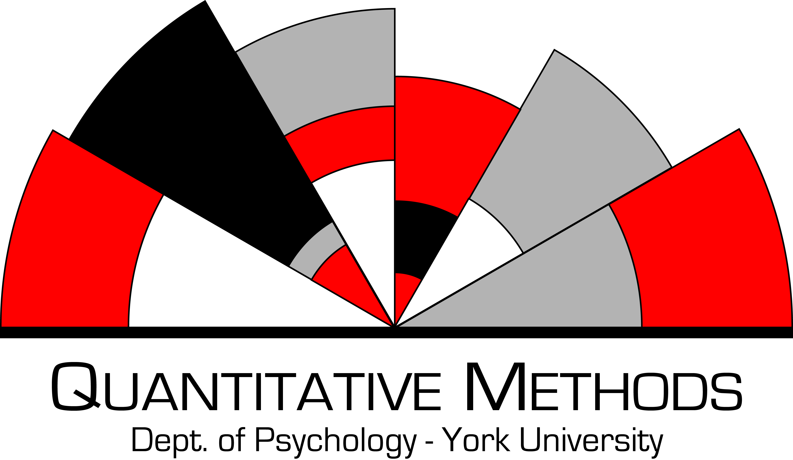

layout: true

```{r setup, include=FALSE}
options(htmltools.dir.version = FALSE)
knitr::opts_chunk$set(
  fig.width=9, fig.height=3.5, fig.retina=3,
  out.width = "100%",
  cache = FALSE,
  echo = TRUE,
  message = FALSE, 
  warning = FALSE,
  fig.show = TRUE,
  hiline = TRUE
)
```

```{r xaringan-themer, include=FALSE, warning=FALSE}
library(xaringanthemer)
style_duo_accent_inverse(
  primary_color = "#1e90ff",
  secondary_color = "#78D1D9",
  title_slide_background_color = "#000000",
  background_color = "#000000",
  text_font_size = "18pt",
  extra_css = list(".background-white" = list("background-color" = "white"),
                   #"h1" = list("text-transform" = "capitalize;"),
                   "a:hover" = list("text-decoration" = "underline"),
                   ".hex-sticker img" = list("position" = "absolute",
                                             "right" = "0px",
                                             "top" = "0px",
                                             "object-fit" = "contain",
                                             "width" = "20%",
                                             "height" = "20%",
                                             "padding" = "10px"),
                   ".img-fill img" = list("object-fit" = "fill",
                                          "height" = "100%",
                                          "width" = "100%",
                                          "overflow" = "hidden"),
                   ".img-fill-50 img" = list("object-fit" = "contain",
                                             "height" = "50%",
                                             "width" = "50%",
                                             "overflow" = "hidden"),
                   ".img-fill-80 img" = list("object-fit" = "fill",
                                             "height" = "80%",
                                             "width" = "80%",
                                             "overflow" = "hidden"),
                   ".img-contain img" = list("object-fit" = "contain",
                                             "height" = "100%",
                                             "width" = "100%",
                                             "overflow" = "hidden"),
                   ".img-cover img" = list("object-fit" = "cover",
                                             "height" = "100%",
                                             "width" = "100%",
                                             "overflow" = "hidden"),
                   ".img-none img" = list("object-fit" = "none",
                                             "height" = "100%",
                                             "width" = "100%",
                                             "overflow" = "hidden"),
                   "yellow" = list("color" = "#F7CB15",
                                   "background-color" =  "#000000"),
                   ".secondary" = list("color" = "#78D1D9"),
                   ".card" = list("transform-style" = "preserve-3d",
                                  "text-shadow" = "2px 2px 4px #000000",
                                  "border-radius" = "50px",
                                  "border-style" = "solid"),
                   ".js-tilt-glare" = list("border-radius" = "50px"),
                   ".threeD-80px" = list("transform" = "translateZ(80px)"),
                   ".threeD-40px" = list("transform" = "translateZ(40px)"),
                   ".threeD-20px" = list("transform" = "translateZ(20px)")
                   ))
```

```{r xaringan-tile-view, echo=FALSE}
xaringanExtra::use_tile_view()
xaringanExtra::use_scribble()
xaringanExtra::use_extra_styles(
  hover_code_line = TRUE,         #<<
  mute_unhighlighted_code = TRUE  #<<
)
```

---
class: center middle

.hex-sticker[]

.card[

.threeD-80px[
# Integrating User Experience and Behavioural Design
]

.threeD-40px[
## A pilot project to help students better understand data and how to clean it
]

.threeD-20px[
Mark Christopher Adkins

York University
]
]

<script type="text/javascript" src="vanilla-tilt.js"></script>
<script type="text/javascript">
	VanillaTilt.init(document.querySelector(".card"), {
		max: 25,
		speed: 400,
		glare: true,
		"max-glare": .8
	});
	
	//It also supports NodeList
	VanillaTilt.init(document.querySelectorAll(".card"));
</script>


---

name: toc

.center[
# Outline
]

* [A bit about myself and the team](#introduction)
* [Project Overview](#overview)
* [Introduction to User experience](#ux)
* [Behavioural Design](#design)
  * [Behavioural Intervention Technologies (BITs)](#bits)
* [UX Evaluation Methods (UXEM)](#uxem)
* [Design Factors](#design-features)

---
name: introduction

# A bit about me

About myself:
> I'm a fifth year Phd student at York University in the
Department of Psychology in the Quantitative Methods area. My research interests are loosely about open science practices, statistical pedagogy, Monte Carlo Simulations, effect size estimates, and integrating technology into classrooms. I've taught introduction to using R and the Tidyverse short courses, as well as workshops on data cleaning and preregistration.

.hex-sticker[]

--

About the team:

 * Monique Herbert
 * Andreja Stajduhar
 * Nahuel Melgarejo
 * A certain 6yo who hijacks most of my meetings and loves to "code"
 
---
name: overview

# Project Overview

In it's current stage, the main goal of this project was to develop a series of interactive web applications which can teach students some basic data cleaning techniques.

--
name: goals

## Goals

* Make a resource which students will actually use (not just that I think they will use)

--

* Incorporate many GAISE (2016) recommendations
  1. Teach statistical thinking.
  2. .secondary[Focus on conceptual understanding.]
  3. .secondary[Integrate real data with a context and a purpose.]
  4. .secondary[Foster active learning.]
  5. .secondary[Use technology to explore concepts and analyze data.]
  6. Use assessments to improve and evaluate student learning.

.right[Guidelines for Assessment and Instruction in Statistics Education, 2016]

???
GAISE by the American Statisical Association

* Originally, this project started as a way to assess in class learning activities
* Noticed that many student in the PSYC 3031 - Intermediate Stats lab struggled and had never even open a spreadsheet or could even find a file on their computer
* Inspiration was also taken from the Data visualization project in that class
  * We wanted students to show that by graphing their data, they could can insights in research questions and many students reported that this project helped them to see data and statistics in a whole new light
  
This project started back when I was a TA for Dr. Monique Herbert, and it quickly escalated from there.

This project is for my Academic Breadth and Comprehension (ABC) paper. So, it is a bit different than I normally study (kind of).

---
name: ux

# User Experience (UX)

> UX includes a user’s “emotions, beliefs, preferences, perceptions, physical and psychological responses, behaviours and accomplishments before, during, and after use”

.right[ISO 9241-210:2019]


???
Everyone here is familiar with UX. You have learned to use Zoom. Regardless of the love/hate relatioship you may or may not have, those perceptions and emotions are intertwined with your experience using the software.

There are whole journals dedicated to HCI (human computer interactions) and many theoretical frameworks which build or touch upon UX.

Not every aspect of the experience is something that can be controlled by the designers of software/websites, but many are.

--

Designing learning-focused content, and the organizational structure of that content, needs to consider UX (and by extension accessibility) right from its inception if it aims to effectively accomplish its learning objectives.

.right[Germonprez, Hovorka, & Gal, 2011]

---
name: design

# Behavioural Design

--

A common behavioural design model is the *Fogg Behavioural Model* (2002, 2009) for developing persuasive design technologies
* Motivation, ability, prompt/trigger
* 8-step design process

--

Lockton, Harrison, and Stanton's (2010) *Design with Intent Method* (DwI)
* Incorporates behavioural economics
  * Kahneman and Tversky's work on heuristics and biases
* Focus on six lenses of influencing behaviour
 * Architectural, errorproofing, persuasive, visual, cognitive, and security lens

--

Behavioural design is already in use for online health interventions and can be leveraged to increase the effectiveness of interventions

.right[Schneider, van Osch, & de Vries, 2012] 

???

Loosely defined as designing with the aim/goal of influencing/changing a user's behaviour

---

.footnote[Photo by <a href="https://unsplash.com/@karlsolano?utm_source=unsplash&utm_medium=referral&utm_content=creditCopyText">Karl Solano</a> on <a href="https://unsplash.com/s/photos/ux?utm_source=unsplash&utm_medium=referral&utm_content=creditCopyText">Unsplash</a>]

.pull-left[

# UX

.img-fill-80[

]
* Identify the target users
* Identify goals for those users
* Outline steps to achieve those goals
]

--

.pull-right[

# Behavioural Design
.img-fill-80[

]

* Identify target behaviours
* Identify potential learning barriers


]

.right[Photo by <a href="https://unsplash.com/@pankajpatel?utm_source=unsplash&utm_medium=referral&utm_content=creditCopyText">Pankaj Patel</a> on <a href="https://unsplash.com/?utm_source=unsplash&utm_medium=referral&utm_content=creditCopyText">Unsplash</a>]


---
name: bits

# Behavioural Intervention Technology Models (BITs)

BITs refers to

> behavioral and psychological interventions that use a broad
range of technologies, such as mobile phones, the Web, and
sensors, aimed at changing behaviors and cognitions related to
health, mental health, and wellness.

.right[Mohr, Schueller, Montaque, Burns, & Rashidi, 2014;]

--

BITs have four components:

.pull-left[
1. Aims
2. Elements
3. Characteristics
4. Workflow
]

--

.pull-right[
1. Why
2. What
3. How (conceptual and technical)
4. When
]

???
BIT models have also been applied to educational settings and not just within the health field.

---
# Digital Nudges

Goal is to guide users' attention to specific aspects of designs.

* Animation
* Anchoring effects
* Use of color
* Use of Icons

---
# Aims (the why)

* Students to have resources they can consult and come back to.

* Students to gain a deeper understanding of data (where it comes from, how to use it, etc.)

* Software independent

* Avoiding the use of statistical jargon

* Essentially removing barriers students have which we see coming up perennially in the intermediate statistics lab

* Partial success if students actively engage in in the interactive components of the website

---

name: uxem

# User Experience Evaluation Methods

Perhaps the hardest part of this project was how to measure success of our goals

First I had to decide what to measure and then how to measure it.

???
To show just how complicated evaluating UX is, check out this diagram of the various disciplines within the domain of UX

---
exclude: true

Many facets:

A literature review of website design and user engagement by Garett, Chiu, Zhang, and Young (2016) identified seven design elements most frequently used in research (industry and academic)

1. Navigation
2. Graphical representation
3. Organization
4. Content utility
5. Purpose
6. Simplicity
7. Readability

???
Most frequently used is a poor metric for including design elements, but they did provide a nice framework during the design phase

---

background-position: center
background-size: contain
background-image: url("../slides/images/UXEM.jpg")


.footnote[Saffer, 2010]

???
From the textbook "Design for Interaction: Creating Innovative Application and Design"

---

# UXEM Taxonomies

1. Research type
  * Survey and expert evaluation
2. Development phase
  * Design and prototype
3. Type of Data
  * quantitative and qualitative
4. Type of Users
  * "normal" user and subject matter experts
5. Time restriction factors

.footnote[Rajeshkumar, Omar, Mahmoud, 2013]

???
I should also mention A/B testing which is common for web design in which multiple versions/layouts are tested with comparable user groups to assess differences in UX.
---

# UXEM

--

I know roughly who the "normal" uses will be (recruited via the undergrad participant pool)

I also am hoping to recruit the experts (along with my committee members)

--

.pull-left[


Photo by <a href="https://unsplash.com/@brookecagle?utm_source=unsplash&utm_medium=referral&utm_content=creditCopyText">Brooke Cagle</a> on <a href="https://unsplash.com/s/photos/web-user?utm_source=unsplash&utm_medium=referral&utm_content=creditCopyText">Unsplash</a>
  
]

--

.pull-right[

]


???
* Using the two-round Delphi survey method (BPS, 2009), multiple rounds of testing will be used to form a consensus among the experts in order to identify design aspects which were done well and those which need improvement.
* These rounds typically start with open-ended feedback to identify salient issues, though these 7 will be provided as a way of prompting feedback on UX specifically as well as the content itself
* These question will ask about the overall experience as well for individual sequence within a lesson or a particular interactive component
* The experts will be surveyed first because their input would be the most valuable for ascertaining the accuracy of the lessons.
* The website will be revised based on expert consensus.
* Next, the undergraduate population will be sampled to assess their overall UX while using the website. 

---
name: design-features

# Design Features

## 1. Navigation

.pull-left[
### Why (aim)
 * Retain students
 * promote revisiting the website
]

.pull-right[
### What (element)
 * NA
]

--

.pull-left[
### How (conceptual)

 * users intuitive learn how to "use" a site
 * knowledge carries over to other lessons
]

.pull-right[
### How (technical)
 * helpful nav-bar
 * "breadcrumbs"
 * tagging

]
  
---
# Design Features (cont)

## 2. Graphical representation

.pull-left[
### Why (aim)
 * reduce the TLDR effect
 * Increase aesthetic appeal
 * make particular design elements instantly recognizable
]

.pull-right[
### What (element)
 * Plots
 * tables
 * Headings
 * Images
]

--

.pull-left[
### How (conceptual)

 * users intuitively learn how to "use" a site
 * knowledge carries over to other lessons
]

.pull-right[
### How (technical)
 * consistent and colour-blind friendly palettes
 * icons
 * progress bars

]

---
# Design Features (cont)

## 3. Organization

.pull-left[
### Why (aim)
 * Increase the chance that users complete entire exercises
 * Uses should know what is "next" or expected at any point within the site/lesson
]

.pull-right[
### What (element)
 * Technical content
 * Lesson/module layouts
]

--

.pull-left[
### How (conceptual)
 * Structuring content using a two-tiered system (within site and lesson)
]

.pull-right[
### How (technical)
 * Using {blogdown} and proper project management to organize content
]

---

# Design Features (cont)

## 4. Content Utility

.pull-left[
### Why (aim)
 * Increase attention to data related topics
]

.pull-right[
### What (element)
 * Content we develop
]

--

.pull-left[
### How (conceptual)
 * Collecting data to assess the content
]

.pull-right[
### How (technical)
 * survey
 * informal feedback from users
]
---

# Design Features (cont)

## 5. Purpose

  * Is there a clearly state purpose
  * Does the user know the purpose of each section
  * Does the user know what is expected of them at each point of the activities?
  * Are the "learning objectives" clear?

---

# Design Features (cont)

## 6. Simplicity

.pull-left[
### Why (aim)
 * Keeping the design/layout simple for each lesson will likely improve the UX by reducing the density of material
]

.pull-right[
### What (element)
 * Content we develop
]

--

.pull-left[
### How (conceptual)
 * NA
]

.pull-right[
### How (technical)
 * By keeping reading time (word count as a proxy) under 5 minutes for any section
 * including graphics where possible (with alt text for screen readers)
]

---
  
# Design Features (cont)

## 7. Readability

.pull-left[
### Why (aim)
 * Remove barriers for students
]

.pull-right[
### What (element)
 * NA
]

--

.pull-left[
### How (conceptual)
 * NA
]

.pull-right[
### How (technical)
 * By keeping reading time (word count as a proxy) under 5 minutes for any section
 * reducing the use of statistical jargon and using consistent language across the website (e.g., always participant vs subject)
]
---

# Technical Specs and Project Sustainability

This entire project was made using RStudio with many fantastic packages:
 * {renv}
 * {blogdown}
 * {DT}
 * {plotly}
 
Skills to pay the bills:
 * javascript
 * R
 * HTML
 * CSS
 * Hugo/Go
 * GitHub
 * Netlify
 * Google Analytics

???

Guides for generating new content will also be written such that content will be internally consist

---

.center[
# Questions
]
