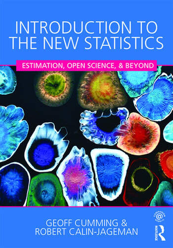
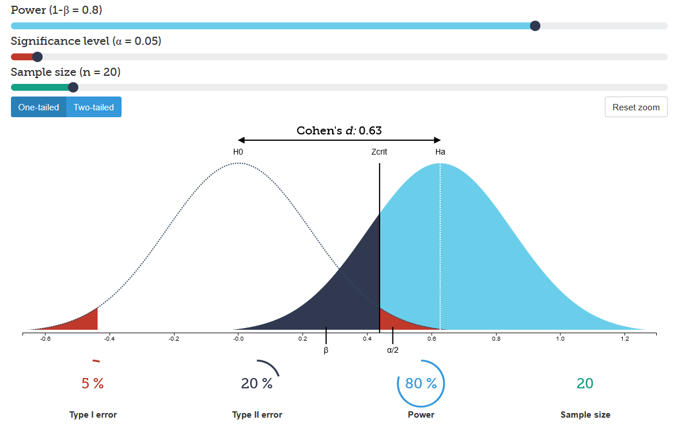

layout: true

```{r setup, include=FALSE}
options(htmltools.dir.version = FALSE)
knitr::opts_chunk$set(
  fig.width=9, fig.height=3.5, fig.retina=3,
  out.width = "100%",
  cache = FALSE,
  echo = TRUE,
  message = FALSE, 
  warning = FALSE,
  fig.show = TRUE,
  hiline = TRUE
)
```

```{r xaringan-themer, include=FALSE, warning=FALSE}
library(xaringanthemer)
style_duo_accent_inverse(
  primary_color = "#1e90ff",
  secondary_color = "#78D1D9",
  title_slide_background_color = "#000000",
  background_color = "#000000",
  text_font_size = "18pt",
  extra_css = list(".background-white" = list("background-color" = "white"),
                   #"h1" = list("text-transform" = "capitalize;"),
                   "a:hover" = list("text-decoration" = "underline"),
                   ".hex-sticker img" = list("position" = "absolute",
                                             "right" = "0px",
                                             "top" = "0px",
                                             "object-fit" = "contain",
                                             "width" = "20%",
                                             "height" = "20%",
                                             "padding" = "10px"),
                   ".img-fill img" = list("object-fit" = "fill",
                                          "height" = "100%",
                                          "width" = "100%",
                                          "overflow" = "hidden"),
                   ".img-fill-50 img" = list("object-fit" = "contain",
                                             "height" = "50%",
                                             "width" = "50%",
                                             "overflow" = "hidden"),
                   ".img-fill-80 img" = list("object-fit" = "fill",
                                             "height" = "80%",
                                             "width" = "80%",
                                             "overflow" = "hidden"),
                   ".img-contain img" = list("object-fit" = "contain",
                                             "height" = "100%",
                                             "width" = "100%",
                                             "overflow" = "hidden"),
                   ".img-cover img" = list("object-fit" = "cover",
                                             "height" = "100%",
                                             "width" = "100%",
                                             "overflow" = "hidden"),
                   ".img-none img" = list("object-fit" = "none",
                                             "height" = "100%",
                                             "width" = "100%",
                                             "overflow" = "hidden"),
                   "yellow" = list("color" = "#F7CB15",
                                   "background-color" =  "#000000"),
                   ".secondary" = list("color" = "#78D1D9"),
                   ".card" = list("transform-style" = "preserve-3d",
                                  "text-shadow" = "2px 2px 4px #000000",
                                  "border-radius" = "50px",
                                  "border-style" = "solid"),
                   ".js-tilt-glare" = list("border-radius" = "50px"),
                   ".threeD-80px" = list("transform" = "translateZ(80px)"),
                   ".threeD-40px" = list("transform" = "translateZ(40px)"),
                   ".threeD-20px" = list("transform" = "translateZ(20px)")
                   ))
```

```{r xaringan-tile-view, echo=FALSE}
xaringanExtra::use_tile_view()
xaringanExtra::use_scribble()
xaringanExtra::use_extra_styles(
  hover_code_line = TRUE,         #<<
  mute_unhighlighted_code = TRUE  #<<
)
```

---
class: center middle

.card[

.threeD-80px[
# Mind the gap: 
]

.threeD-40px[
## Assessing current pedagogical approaches to teaching effect size estimation and interpretation in university level psychology statistics classrooms
]

.threeD-20px[
Mark Christopher Adkins

York University
]
]

<script type="text/javascript" src="vanilla-tilt.js"></script>
<script type="text/javascript">
	VanillaTilt.init(document.querySelector(".card"), {
		max: 25,
		speed: 400,
		glare: true,
		"max-glare": .8
	});
	
	//It also supports NodeList
	VanillaTilt.init(document.querySelectorAll(".card"));
</script>


---

name: toc

.center[
# Outline
]

* [A bit about me](#introduction)
* [Effect Sizes](#background)
  * [Usage](#usage)
  * [Reporting](#reporting)
* [8 Techniques for estimating and interpreting Effect Sizes](#techniques)
* [The Gap](#gap)

---
name: introduction

# A bit about me `r fontawesome::fa(name="id-card")`

About myself:
> I'm a sixth year Phd student at York University in the
Department of Psychology in the Quantitative Methods area. My research interests are loosely about open science practices, statistical pedagogy, Monte Carlo Simulations, effect size estimates, and integrating technology into classrooms. I've taught introduction to using R and the Tidyverse short courses, as well as workshops on data cleaning and preregistration.

.hex-sticker[]

---
name: background

# Effect Sizes

> "the amount of anything of interest"

.right[Cumming & Fidler, 2009]

--

> "some magnitude (or size) of the impact (or effect) of a predictor on an outcome variable"

.right[Pek & Flora, 2018]

--

> "Quantitative reflection of the magnitude of some phenomenon that is used for the purpose of addressing a question of interest"

.right[Kelley & Preacher, 2012]

???
* Effect sizes are a measure of the “practical significance” for an effect of interest. In other words, when interpreted through the context of a study does an effect have meaningful, real-world, implications.

* Effect sizes can still be hard to grasp, particularly when the name itself invokes notions of a causal relationship. Can we still meaningfully call something an effect size in an observational study? The effect of what?

* For better or worse, the causal implications of effect size is not considered in this study

---

# The *New Statistics*

> "recommended practices, including estimation based on effect sizes, confidence intervals, and meta-analysis"

.right[Cumming, 2014]

.pull-left[
.center[
.img-fill-50[


]
]
]

--

## How new are they?

--

* Effect sizes have their own history dating back to around 1940


???
* Though their rise to popularity in recent decades has been speculated to be in reaction to Null Hypothesis Statistical Testing (Huberty, 2022; Wilkinsen, 1999), effect sizes are vitally important because they have their own intrinsic and indispensable value for psychological research

---
name: usage

# Effect Size Usage

.pull-left[
* Power Analyses
  * Integral part of every power analysis
  * Often required by:
      * funding bodies `r fontawesome::fa(name="hand-holding-dollar")`
      * associations  
      * journal editors `r fontawesome::fa(name="people-group")`
      
* Sample size Planning
]

.pull-right[
.center[
.img-fill-100[

]
https://rpsychologist.com/d3/nhst/
]
]


---
name: reporting

# Reporting Practices
## aka 'A Multi-Faceted Mess' `r fontawesome::fa(name="dumpster-fire")`

Crucial information is often omitted from published studies such as :
  * rationale for choosing an effect size
  * which variant of an effect size was used
  * estimates of uncertainty

.footnote[Beribisky et al., 2019]

--

55.20% of analyses failed to provide justification for effect sizes

--

34.67% cited prior research as their justification of estimating an effect size


???

* While this method of effect size estimation is perfectly valid in many research contexts, there many other methods/techniques which are under utilized or reported. Regardless of which method a researcher decides is best, there is a lot of room for improvement regarding effect size reporting practices.

* Omission of a researcher’s justification can be viewed at best as a space-saving practice, or at worst a failure to fully understand how critical this information is for accurate interpretation of effects within the context of a study.

* Rational justification for any data-analytic choices should always be presented.

* This is especially true for effect sizes because they provide other researchers with the necessary information to critically evaluate the results of that research.

* Transparent and complete reporting of effect size computations and decisions are a crucial part of quantitative research, as it further aids meta-analytic work and increases the reproducibility of the research

---
name: techniques

# Estimation/Interpretation Techniques

Despite the many resources available for computing and interpreting effect sizes, they take a long time (if ever) to make their way into undergraduate and graduate level statistical training

--

.pull-left[
Evidence indicates that it takes an exorbitant amount of time (if ever) to see changes reflected within statistical curriculum
.right[(Cumming et. al, 2007)]
]

--

.pull-right[
.center[
.img-fill-50[

]
Photo by <a href="https://unsplash.com/es/@santesson89?utm_source=unsplash&utm_medium=referral&utm_content=creditCopyText">Andrea De Santis</a> on <a href="https://unsplash.com/photos/CzcpgRjLK5o?utm_source=unsplash&utm_medium=referral&utm_content=creditCopyText">Unsplash</a>
  
]
]

---

# Estimation/Interpretation Techniques

Cook et al. (2014) conducted a literature review of bio-medical and social science databases and outlined seven techniques.

--

Simulation based effect size estimation is being considered as the $8^{th}$ technique for the purposes of this present research because of its growing utility and popularity

???
I do want to pause for a moment to note that the techniques I will describe in the following slide are not mutually exclusive of each other. That is to say, researchers can use multiple methods to help interpret or estimate effect sizes.
---

# Estimation/Interpretation Techniques

.pull-left[

## Technique 1:

### Anchor Based `r fontawesome::fa(name="anchor")`
  
  Using an anchor or reference value which has known substantive meaning against which to compare the magnitude of differences. E.g., comparing patients who showed at least a certain level of improvement compared to patients who showed no improvement on a specific scale/instrument.
]

--

.pull-right[
## Technique 2:

### Distribution Based
  
Interpreting the size of an effect relative to the precision of the scale used to measure that effect.
]

???
Distribution based:
* NHST precision/error, is the mean within 2 SD of the null hypothesized mean
* NHST test themselves
* While strictly speaking, I don't consider a NHST test statistics to be an effect size in an of itself, there is something to be said for using the precision of a test.
* Given that a test statistic is tied closely to the sample size, I would argue that this is not the best use case
---

# Estimation/Interpretation Techniques

.pull-left[

## Technique 3:

### Health-Economic (cost-benefit analysis) `r fontawesome::fa(name="sack-dollar")`
  
Evaluating the costs involved in increasing an outcome by a certain magnitude. E.g., how much effort should a student exert using new study materials to increase their grade on a test by 5%.
]

--

.pull-right[
  ## Technique 4:

### Opinion-Seeking (expert opinion) `r fontawesome::fa(name="user-tie")`
  
Consulting with experts within a substantive area to determine important or plausible magnitudes of an effect.
]

---

# Estimation/Interpretation Techniques

.pull-left[

## Technique 5:

### Pilot-Study `r fontawesome::fa(name="jet-fighter")`
  
Conducting a smaller, though similar, study to produce an estimate of the effect size in question.
]

--

.pull-right[

## Technique 6:

### Review of Evidence Base (literature review or meta-analysis) `r fontawesome::fa(name="meta")`
  
Conducting or using a meta-analysis as obtain or interpret an effect size estimate. Conducting a literature review for the same purpose as a meta-analysis.
]

---

# Estimation/Interpretation Techniques

.pull-left[

## Technique 7:

### Standardized effect sizes
  
Using published or recommended guidelines of standardized effect sizes to interpret the magnitude of an effect.
]

--

.pull-right[

## Technique 8:

### Simulation based effect sizes `r fontawesome::fa(name="computer")`

Conducting a simulation to estimate ranges of plausible effect sizes. Simulation results could also be used to establish a reference point for interpreting the magnitude of an effect.
]

---
name: gap

# Mind The Gap

--

.pull-left[
Is there a problem with statistical training in which little to no time is spent teaching how to estimate, interpret, and report effect sizes?
]

.pull-right[
.center[
.img-fill-50[


]
]
]

.footnote[Photo by <a href="https://unsplash.com/de/@arturtumasjan?utm_source=unsplash&utm_medium=referral&utm_content=creditCopyText">Artur Tumasjan</a> on <a href="https://unsplash.com/photos/n9QMxwaTb7c?utm_source=unsplash&utm_medium=referral&utm_content=creditCopyText">Unsplash</a>
]

???
While there appears to be a gap within the literature about understanding and reporting effect sizes, there are no data available pertaining to the existence of a gap within the classroom regarding the estimation and interpretation of effect sizes.

**Specifically, I want to assess the prevalence (or lack of) these eight techniques.**

* I already discussed reporting practices which would be crude measure of how important aspects regarding effect sizes are missing.

[CLICK]

* I want to know why they are missing.

  * Do editors make them triage their manuscripts and these details fall by the wayside
  
  * Or is it a lack of statistical training/emphasis on understanding how to estimate and interpret effect sizes?

  * Maybe its the case that they simply disagree with statistical experts about the vital importance of fully reporting effect sizes and interpreting them in the context of their study or line of research (attitudinal)

---

# Barrier Related Hurdles

.pull-left[

* Are some of these techniques more complicated than others leading to their under-use within a classroom setting?
* Do instructors themselves have sufficient training to teach these techniques?
* Can it also be the case that many instructors (grad students included) overly rely on published textbooks to create their lecture materials which may be out of date in relation to current statistical recommendations?

]

.pull-right[
.center[
.img-fill-50[


]
]
]

.footnote[Photo by <a href="https://unsplash.com/de/@interactivesports?utm_source=unsplash&utm_medium=referral&utm_content=creditCopyText">Interactive Sports</a> on <a href="https://unsplash.com/photos/VYTQNnaboUA?utm_source=unsplash&utm_medium=referral&utm_content=creditCopyText">Unsplash</a>
  ]

---
# Instructor Assumptions `r fontawesome::fa(name="person-chalkboard")`
.center[
.img-fill-50[

]
]

.footnote[Photo by <a href="https://unsplash.com/pt-br/@domlafou?utm_source=unsplash&utm_medium=referral&utm_content=creditCopyText">Dom Fou</a> on <a href="https://unsplash.com/photos/YRMWVcdyhmI?utm_source=unsplash&utm_medium=referral&utm_content=creditCopyText">Unsplash</a>
  ]

???
* Are undergraduate teachers omitting this information on the assumption that it is more appropriate for graduate level students?

* Can interactive exercises be developed for students to aid their understanding of these techniques?

* Are graduate teachers assuming that sufficient basics were instilled in their students that effect size coverage within their own classrooms is redundant and consequently a waste of valuable class time?

* Do instructors believe that curricular change is important or even necessary with regard to effect size training?

* Or worse yet, are students adequately trained at all levels, but principal investigators or journal editors are influencing poor reporting practices against the overwhelming advice of statistical experts and association bodies?

---
# Present Study

Three Phases

1. Data collection
  * survey of statistics instructors at Canadian universities
2. Design interactive modular activities
  * "plug-and-play" to make it easier to integrate into lectures or used for at-home-learning
  * reduce instructor training
3. Develop R package
  * to enable easy, effect-size driven, data generation functions
  * in-class demonstrations, homework assignments, exam questions, etc.

---
# Present Study

Currently in phase 1: Data Collection

* Recently granted ethical clearance to begin data collection

    * Survey was constructed using formr.org

---

background-position: center
background-size: contain
background-image: url("../slides/images/form-spreadsheet.PNG")

---

background-position: center
background-size: contain
background-image: url("../slides/images/form-example.PNG")

---
# Present Study

At the end of the study, participants will be asked if the want to be contacted to field-test the interactive lessons to provide feedback.

--

The feedback will be used to improve the lessons which will likely be released/published on the web

---

background-position: center
background-size: contain
background-image: url("../slides/images/simone-secci-49uySSA678U-unsplash.jpg")

# Questions
