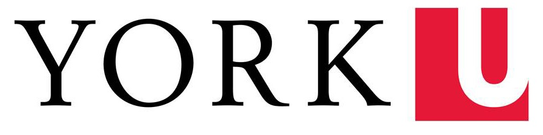

layout: true

```{r setup, include=FALSE}
options(htmltools.dir.version = FALSE)
knitr::opts_chunk$set(
  fig.width=9, fig.height=3.5, fig.retina=3,
  out.width = "100%",
  cache = FALSE,
  echo = TRUE,
  message = FALSE, 
  warning = FALSE,
  fig.show = TRUE,
  hiline = TRUE
)
```

```{r xaringan-themer, include=FALSE, warning=FALSE}
library(xaringanthemer)
style_duo_accent_inverse(
  primary_color = "#1e90ff",
  secondary_color = "#78D1D9",
  title_slide_background_color = "#000000",
  background_color = "#000000",
  text_font_size = "18pt",
  extra_css = list(".background-white" = list("background-color" = "white;"),
                   #"h1" = list("text-transform" = "capitalize;"),
                   "a:hover" = list("text-decoration" = "underline;"),
                   ".hex-sticker img" = list("position" = "absolute;",
                                             "right" = "0px;",
                                             "top" = "0px;",
                                             "object-fit" = "contain;",
                                             "width" = "20%;",
                                             "height" = "20%;",
                                             "padding" = "10px;"),
                   ".img-fill img" = list("object-fit" = "fill;",
                                          "height" = "100%;",
                                          "width" = "100%;",
                                          "overflow" = "hidden;"),
                   ".img-fill-50 img" = list("object-fit" = "contain;",
                                             "height" = "50%;",
                                             "width" = "50%;",
                                             "overflow" = "hidden;"),
                   ".img-fill-80 img" = list("object-fit" = "fill;",
                                             "height" = "80%;",
                                             "width" = "80%;",
                                             "overflow" = "hidden;"),
                   ".img-contain img" = list("object-fit" = "contain;",
                                             "height" = "100%;",
                                             "width" = "100%;",
                                             "overflow" = "hidden;"),
                   ".img-cover img" = list("object-fit" = "cover;",
                                             "height" = "100%;",
                                             "width" = "100%;",
                                             "overflow" = "hidden;"),
                   ".img-none img" = list("object-fit" = "none;",
                                             "height" = "100%;",
                                             "width" = "100%;",
                                             "overflow" = "hidden;"),
                   "yellow" = list("color" = "#F7CB15;",
                                   "background-color" =  "#000000;"),
                   ".card" = list("transform-style" = "preserve-3d;",
                                  "text-shadow" = "2px 2px 4px #000000;",
                                  "border-radius" = "50px;",
                                  "border-style" = "solid;"),
                   ".js-tilt-glare" = list("border-radius" = "50px;"),
                   ".threeD-80px" = list("transform" = "translateZ(80px);"),
                   ".threeD-20px" = list("transform" = "translateZ(20px);")))
```

---
class: center middle

.hex-sticker[]

.card[

.threeD-80px[
# So, you want to be a SimDesign(er)?
]

.threeD-20px[
Mark Christopher Adkins

York University
]
]

<script type="text/javascript" src="vanilla-tilt.js"></script>
<script type="text/javascript">
	VanillaTilt.init(document.querySelector(".card"), {
		max: 25,
		speed: 400,
		glare: true,
		"max-glare": .8
	});
	
	//It also supports NodeList
	VanillaTilt.init(document.querySelectorAll(".card"));
</script>


---

name: toc

.center[
# Table of Contents
]

* [The bit about myself and the package creator](#introductions)
* [Introduction to Monte Carlo Simulations](#mcs)
* [SimDesign's structure and design philosophy](#design)
  * [Step 1: Generate a structural template](#step1)
  * [Step 2: Modify the default `Design` object](#step2)
  * [Step 3a: Modify the `Generate() function`](#step3a)
  * [Step 3b: Modify the `Analyse() function`](#step3b)
  * [Step 3c: Modify the `Summarise() function`](#step3c)
  * [Step 4: Modify the arguments to the `runSimulation()` function](#step4)
* [Debugging](#debugging)
* [Aggregating Simulations](#aggregate)
* [Re-Summarising a MCS](#resummarise)
* [Macro Reproducibility](#macro_rep)
---
name: introductions

# A bit about me

About Myself:
> I'm a fourth year Phd student at York University in the
Department of Psychology in the Quantitative Methods area. My research interests are loosely about open science practices, statistical pedagogy, Monte Carlo Simulations, effect size estimates, and integrating technology into classrooms. I've taught introduction to using R and the Tidyverse short courses, as well as workshops on data cleaning and preregistration.

.hex-sticker[]
 
--


About the Creator:
> Phil Chalmers is an Assistant Professor at York University in the
Department of Psychology in the Quantitative Methods area, and an Associate Coordinator in the Statistical Consulting Service. He is an author of multiple R packages hosted on CRAN (e.g., mirt, mirtCAT, SimDesign, matlib), and focuses on research pertaining to psychological measurement, latent variable modelling and computational statistics.


```{r echo=FALSE, message=FALSE, warning=FALSE}
library(SimDesign)
library(tidyverse)
```

---
name: mcs

# Monte Carlo Simulations (MCS)

> MCS studies are computer-driven experimental investigations in which certain parameters, such as population means and standard deviations that are known a priori, are used to generate random (but plausible) sample data.

.footnote[Mooney, C. Z. (1997), Monte Carlo Simulations, Thousand Oaks, CA: Sage]

---

# Empirical Research

.footnote[<span>Photo by <a href="https://unsplash.com/@curranrob?utm_source=unsplash&amp;utm_medium=referral&amp;utm_content=creditCopyText">Rob Curran</a> on <a href="https://unsplash.com/s/photos/crowd?utm_source=unsplash&amp;utm_medium=referral&amp;utm_content=creditCopyText">Unsplash</a> and <a href="https://unsplash.com/@mbaumi?utm_source=unsplash&amp;utm_medium=referral&amp;utm_content=creditCopyText">Mika Baumeister</a> on <a href="https://unsplash.com/s/photos/data?utm_source=unsplash&amp;utm_medium=referral&amp;utm_content=creditCopyText">Unsplash</a></span>]

.pull-left[
.img-fill-80[

]
* Identify a population of interest
* Pick attributes we are interested in
* Construct a theory
]

--

.pull-right[
.img-fill-80[

]

* We collect measurements
* Analyze the data to draw a conclusion or answer research questions
* Data are only ever a snapshot of our subjects
]

???
Papers are just advertising for the real work.
---

# Monte Carlo Simulations (MCS)

Simulations are not much different than empirical research (in fact MCS are a kind of empirical research).

--

MCSs:

* a well articulated research question 
* the design of the experiment must be well thought out
* we clearly outline the assumptions we are making about the data or the data generating process/mechanisms

Without each of these pieces, results can be inconclusive, or worse yet misleading.

--

I also recommend you check out "Episode 23: Carlo. Monte Carlo" of the Quantitude podcast on Monte Carlo Simulations hosted by Patrick Curran and Greg Hancock.

.footer[[https://quantitudepod.org/listen/](https://quantitudepod.org/listen/)]

---

# Monte Carlo Simulations (MCS)

To paraphrase my favourite part of that podcast.

> Simulations do not replace thinking

--

That's it!

--

That's the slide!
???
Designing a MCS follows the same principles as any other empirical research
Just because you are simulating data doesn't hurt our ability to make inferences.
If anything, MCS results can help setup anchor points or boundaries for understanding particular phenomena. We can infer that when a particular set of assumptions are met, we have strong evidence and we can see as assumption start to drift, how estimates (or whatever your outcomes are) are affected
---

# Research Question

What if we wanted to explore aggregate differences between two populations: a **wait-listed control group** and an **intervention group**.

More specifically, we want to examine how <yellow>statistical power</yellow> and <yellow>Type-I error rates</yellow> of a *t*-test fluctuate as a function of population <blue>mean differences</blue>, <blue>sample size</blue>, and <blue>unequal variances</blue>.

--

I can't stress enough how important it is to have a well articulated research question <mark>IN ADVANCE</mark> of actually coding.

As with any statistical test/model, there are many assumptions involved, and the beauty of MCS is that you have control over the data generation so you can ensure that certain assumptions are satisfied, while systematically varying the degree of violation for others

---
# Research Question

.pull-left[
### <blue>Factors</blue>:

* population mean differences
  * Levels: 0,  0.5
* unequal population variances (as a ratio)
  * Levels: 1.0, 2.0
* sample size
  * Levels: 30, 60

The levels of these factors must also carry substantive meaning and require thought and a defensible justification.

You might start with the ends as anchor points, and then create even intervals between these anchors.
]

--

.pull-right[
### <yellow>Outcomes</yellow>:

* Statistical power
* Type I error rate

**Statistical power** is the probability that a test will correctly reject the null hypothesis.

**Type I errors** occur when a test incorrectly rejects the null hypothesis (aka False Positive)
]
---
name: design

# SimDesign: Structure

The SimDesign package uses a novel approach  to conducting MCSs.

It functionally separates the Monte Carlo simulation into three distinct pieces:

* data generation
* data analysis
* summarizing the `R` replications for each condition

???
The `SimDesign` package emulates the theoretical separation typically found in empirical research where the analysis stage is agnostic to the data generation process.

---

background-position: center
background-size: contain

background-image: url("../slides/images/workflow.bmp")

???
1. Generate a structural template
2. Modify the default `Design` object
3. Modify the `Generate()`, `Analyse()`, and `Summarise()` functions
4. Modify the arguments to the `runSimulation()` function

---

name: step1

# Step 1: Generate a structural template

We begin by running the following code in the R console.

```{r eval=FALSE,echo=TRUE}
# running this code in the console will create
# a skeleton for our MCS
SimDesign::SimFunctions(file = "mcs",
                        comments = TRUE)
```

--

`comments = TRUE` will insert a few helpful comments throughout the skeleton of our template.

.hex-sticker[]

???

If you are using Rstudio, the file will be opened automatically. The file will also be saved into the current working directory (which if you setup your R project and opened it in RStudio will be the root directory of the project)

---
name: step2

# Step 2: Modify the default `Design` object

The design object is how SimDesign keeps your simulation organized and makes it easy to add levels to existing factors, or to even add new factors.

```{r eval=FALSE}
### Define design conditions
Design <- createDesign(factor1 = NA,
                       factor2 = NA)
```

The resulting `Design` object is a tibble/data.frame has which is a fully crossed design object of all levels of your factors.

Each row is a unique combination of the levels of your factors

---

# Step 2: TIPS

* pick meaningful factor names    

  * e.g., sample_size, n       

--

* Start small
  * only include a few levels of your factors just to get the simulation working first    

--

* include all of the relevant factors which pertain to the generation, analysis, or summarization of your data

--

* the `Design` object is a tibble, and can be manipulated and using the dplyr "verb" functions

???
* pick meaningful factor names
  * we will see later that SimDesign makes use of these names in such a way that it completely avoids the unnecessary creation of similarly named objects which can lead to difficult debugging
* Start small
  * it is straightforward to add additional levels by inserting them, re-running the `createDesign()` function and then `runSimulation()`
* include all of the relevant factors
  * they are essentially placeholders which we can use to programmatically integrate the factor into our code, later we can flesh out the levels and SimDesign will handle the rest.
  
---

# Step 2: Break-out Session 1

Using our research question, update the `createDesign()` function in the 'mcs.R' file we created to include any relevant factors (including any new levels you think might be appropriate).

Feel free to add additional factors/levels which might be interesting to you.

.pull-left[
### <blue>Factors</blue>:

* population mean differences
  * Levels: 0
* unequal population variances (as a ratio)
  * Levels: 1.0
* sample size
  * Levels: 30
]

.pull-right[
### TIPS

* pick meaningful factor names
* use a single level for each factor to get started
]

--

.hex-sticker[]
---

# Step 2: Discussion

What did you come up with?

Were there any new factors (or new levels of old factors)?


```{r}
### Define design conditions
Design <- createDesign(mean_diff = c(0),
                       sample_size = c(30),
                       var_ratio = c(1))
```

???

Notice, I included all relevant factors (for either my generation or analysis stage), and one initial level.

This first level can be a good place to use as a baseline or reference for the performance of the other design conditions. Ideally, the levels of this factor should be "well-behaved" because we are just setting up our simulation for the first time.

Remember, just like empirical research, this is an iterative process and we have to start somewhere.

---

name: step3a

# Step 3a: `Generate()`

Next, let's breakdown the anatomy of the `Generate()` function:

Like every R function, it needs a name (which is provided), arguments (which are provided), and a body (which is the hard part).

* `condition`
  * this is a single row from our `Design` object we created in step 2
* `fixed_objects`
  * this is a list (NULL by default) which can contain additional objects we need to remain constant across all conditions.


```{r eval=FALSE}
Generate <- function(condition, fixed_objects = NULL) {
    # Define data generation code ...

    # Return a vector, matrix, data.frame, or list
    dat <- data.frame()
    dat
}
```

???
  * Globally defined/sourced functions are automatically passed into the core SimDesign functions
I recommend defining them in their own R script file and using the `source()` to keep you code organized and easier to debug
  * it is usually not necessary, but if there were computationally intensive objects which remain constant across your simulation conditions, you could generate them in advance and pass them as elements of the list `fixed_objets`
---

# Step 3a: `Generate()`

SimDesign was deliberately designed to be flexible in terms of data structures passed between the core set of functions. Most times, a data.frame/tibble will be sufficient, but you can return any type of object you need.

--

Whatever you decide, remember that the `dat` object is what gets passed onto the `Analyse()` function, so knowing the type of data structure you are passing makes it easier to unpack and use the data in an efficient manner.

--

For our current example, we know that we are going to conduct some form of a *t*-test using this data, so I will demonstrate how to create some data in 'long' format.

---

# Step 3a: TIPS

There is a handy function within the SimDesign package which similar to base R's `attach()`

```{r eval=FALSE}
Attach(condition)
```

This function extracts any object contained in a `list` object (e.g., data.frames or tibbles) and places them into the environment in which the function was called

Benefits:

* reduces the amount of typing
* makes the code more readable
* reduces the cognitive load of object tracking
* eliminates the need to rename conceptually identical objects
* capitalizes on the originally meaningful factor names defined in the `Design` object

---

# Step 3a: TIPS cont.

Think carefully about how data generation should change as a function of the current condition of the simulation.

--

**Example**: 

For every row in our `Design` object, data are always sampled from a normal distribution, but the center of that distribution is defined using the current level of a factor.

.pull-left[
**<yellow>Before</yellow>**
```{r eval=FALSE}
# generate data
rnorm(n = 30,
      mean = 0,
      sd= 1)
```
]

.pull-right[
**<yellow>After</yellow>**
```{r eval=FALSE}
Attach(condition)
# generate data
rnorm(n = 30,
      mean = mean_diff,
      sd = 1)
```
]

???
Does the current level of a factor alter how a particular function should perform, or does it indicate that an entirely different sequence of code be used?

i.e., can we just change a function argument or do we need to use logical branching
---

# Step 3a: TIPS cont.

Logical branching might be needed instead to ensure that only the appropriate code is run continent on the current condition

**Example**: 

Perhaps, we have another factor ("dist") in our `Design` object that contains information about which distribution to use for sampling

.pull-left[
**<yellow>Before</yellow>**
```{r eval=FALSE}
# generate data
rnorm(n = 30,
      mean = 0,
      sd= 1)
```
]

.pull-right[
**<yellow>After</yellow>**
```{r eval=FALSE}
Attach(condition)

if (dist == "normal") {
  # use a normal distribution
  rnorm(n = 30,
        mean = 0,
        sd= 1)
} else if (dist == "t") {
  # use a t distribution
  rt(n = 30,
     df = 35)
}
```

]
---


# Helpful Data Generation Functions


.pull-left[
**<yellow>Base R / stats</yellow>**

* `rnorm()`
* `rt()`
* `rbinom()`
]


.pull-right[
**<yellow>SimDesign</yellow>**

* `rHeadrick()`
* `rint()`
* `rinvWishart()`
* `rmgh()`
* `rmvnorm()`
* `rmvt()`
* `rtruncate()`
* `rValeMaurelli()`
]

{extraDistr} (Wolodzko, 2019) for additional optimized distribution functions outside base R

---
# Step 3a: Break-out Session 2

Use the factor levels from `condition` to generate two normally distributed samples and save them into a tibble/data.frame to be used later to conduct a *t*-test.

```{r eval=FALSE}
# open the help documentation for the t.test() and rnorm() functions
?t.test
?rnorm
```

* first Attach the `condition` object
* use the three factors to generate 2 samples
* save them as columns/vectors in the data.frame `dat`

--

.hex-sticker[]

---
# Step 3a: `Generate()`

```{r}
Generate <- function(condition, fixed_objects = NULL) {
  # Define data generation code ...
  # expose the condition levels
  Attach(condition)
  
  # define control group variance in case I need to change it
  control_var <- 1
  
  # create two vectors: group, and score using all
  # of the variables from the current condition
  # (sample_size, mean_diff, and var_ratio)
  dat <- tibble(group = rep(x = c("Group 1","Group 2"),
                            times = c(sample_size,sample_size)),
                score = c(rnorm(n = sample_size,
                                sd = sqrt(control_var)),
                          rnorm(n = sample_size,
                                mean = mean_diff,
                                sd = sqrt(control_var*var_ratio))))
  
  # Return a vector, matrix, data.frame, or list
  dat
}
```

---

# Step 3a: `Generate()`

Remember, the `Generate()` function and `Design` object are just regular functions and tibbles. So we can test them out  in the console

```{r eval=FALSE,echo=TRUE}
# test the first condition
Design[1,] %>% 
  Generate() %>% 
  group_by(group) %>% 
  summarise(mean = mean(score),
            sample_size = n(),
            var = var(score))
```

```{r eval=TRUE,echo=FALSE,highlight.output=c(5,6)}
# test the first condition
Design[1,] %>% 
  Generate() %>% 
  group_by(group) %>% 
  summarise(mean = mean(score),
            sample_size = n(),
            var = var(score),
            .groups = "keep")
```

---

name: step3b

# Step 3b: `Analyse()`

Next, we need to analyze our data. The `Analyse()` function from our skeleton template should look like this:

```{r eval=FALSE}
Analyse <- function(condition, dat, fixed_objects = NULL) {
    # Run statistical analyses of interest ... 

    # Return a named vector or list
    ret <- c(stat1 = NaN, stat2 = NaN)
    ret
}
```

--

Keep in mind the steps we want this function to complete:

  * use the data generated from the `Generate()` function (which is passed in as the `dat` object)
  * perform an analysis
  * extract the desired results
  * structure the results into a named vector or list
  * return the structured results (`ret` by default)


???
Notice that this core function is internally consistent with the `Generate()` function. The first argument is `condition`, and this function also has access to objects (if any) that were passed in via the `fixed_objects` list.

---
# Step 3b: TIPS

Similar in spirit to the `Generate()` function, think about which (if any) of your factors might alter the analysis performed.

It is possible that your research question pertains only to the generative mechanisms, and the analysis will remain unchanged (like our current example).

--

Do our factors require logical branching or simply using function arguments to achieve the desired results?

--

One big tip here is to never use magic numbers (i.e., numbers intended to be used as constants without explanation).

--

Taking this one step further, create objects to define and hold these values at the beginning of the function in case you want to systematically vary them using new factors in our `Design` object later.

???
These can be hard to foresee, but it does build in easier extensibility

---
# Step 3b: Break-out Session 3

Using the data object, `dat`, conduct a *t*-test and extract out the p-value (and any other statistics you feel might be important).

--

.hex-sticker[]

---
# Step 3b: `Analyse()`

Here is one possible solution you could try:

```{r eval=FALSE}
Analyse <- function(condition, dat, fixed_objects = NULL) {
    # build in extensiblity
    equal_variances <- FALSE
    
    # run the t-test
    test_results <- t.test(formula = score ~ group,
                           data = dat,
                           var.equal = equal_variances)
    
    # extract the important values from the t-test
    ret <- broom::tidy(test_results)
    
    # fix names of ret to be more meaningful
    colnames(ret)[c(1,2,3,6)] <- c("est_mean_differnce", "mean_1",
                                   "mean_2", "df")
    ret
}
```

---
# Step 3b: `Analyse()`

We could also just extract the *p* value like this:

```{r eval = FALSE}
    ret <- c(p.value = test_results$p.value)
```

--
```{r eval=FALSE}
vignette("available-methods")  # check which models have a tidier function
```

---

name: step3c

# Step 3c: `Summarise()`

Finally, let's look at the skeleton of our `Summarise()` function.

```{r eval=FALSE}
Summarise <- function(condition, results, fixed_objects = NULL) {
    # Summarise the simulation results ...

    # Return a named vector of results
    ret <- c(bias = NaN, RMSE = NaN)
    ret
}
```

--

I want to highlight a few things here:

* The `Summarise()` function only has access to the results returned from the `Analyse()` function
  * These are combined row-wise such that if the condition were replicated 1000 times, there will be 1000 rows of extracted results
* We still have access to the current condition and any parameters contained within it
  * This is important because this function doesn't have access to the generation or analysis functions directly, parameters used in those functions are still available to compute summary stats like bias etc.
  
---

# Step 3c: `Summarise()`

This is the point which having a clearly articulated research question pays off. We should have clearly identified our outcomes <mark>PRIOR</mark> to coding our MCS.

--

For each condition, we have have a set `R` of quantities of interest passed on from `Analyse()` which we need to summarize. Each of which must be summarized carefully to avoid any errors.

--

For me, writing this function is where I encountered the most trouble, and consequently required the most time debugging.

--

The key was to think about how do I condense (i.e., summarize) the statistics I extracted from my `Analyse()` function down to a single number (or pair of numbers if you are after confidence intervals) such that I now have the <yellow>outcome variables</yellow> I defined at the outset of this MCS.

--

Similar to the `Analyse()` function, think about how you are going to structure the results. The results MUST be as a named vector or data.frame which has a single row.

???
Though as of last week, the development version of SimDesign added support for returning lists from the summarise() funciton

---

# Step 3c: TIPS

Often, computing complicated summary statistics is an easy place to make programming mistakes, and often they are hard to spot and debug.

--

To help, the SimDesign has many built in summary statistics which are easy to use, and most importantly less error-prone (because they have been tested) than custom summary functions.

---


.footer[https://www.tqmp.org/RegularArticles/vol16-4/p248/index.html]

???
This table can be found in the on the last page of our article

---
exclude: true
# Step 3c: `Summarise()`

Let's try it out!


.hex-sticker[]

---

# Step 3c: `Summarise()`

Here is one way to compute the empirical detection rate, `EDR()`.

```{r eval=FALSE}
Summarise <- function(condition, results, fixed_objects = NULL) {
  # explicitly set the alpha level
  alpha_rate <- .05
  
  # Summarise the simulation results ...
  ret <- data.frame(edr = EDR(p = results$p.value,
                              alpha = alpha_rate))
  
  # Return a named vector of results
  ret
}
```

--

Even now we have to think carefully about what our results mean. We just computed the proportion of `R` simulations within each condition for which *p* was less than an $\alpha$ of .05

--

.pull-left[
If <blue>**`mean_diff = 0`**</blue>, then the EDR is the Type I error rate (i.e., FALSE POSITIVE RATE)
]
.pull-right[
If <blue>**`mean_diff` $\ne$ 0**</blue>, then the EDR is the power (i.e., TRUE POSITIVE RATE)
]

---

name: step4

# Step 4: `runSimulation()`

Now that we have the necessary building blocks for running a simulation, this final step involves running a single function, `runSimulation()`

This function will do all of the "heavy lifting" for us.

---

background-position: center
background-size: contain

background-image: url("../slides/images/workflow.bmp")

---

# Step 4: `runSimulation()` Arguments

Our skeleton is sufficient to run the simulation immediately.

<blue>Core components</blue>:

* a design object
* the number of replications per condition to perform
* a function to generate data
* a function to analyze data
* a function to summarize data


```{r eval=FALSE}
### Run the simulation

res <- runSimulation(design=Design,
                     replications=1000,
                     generate=Generate, 
                     analyse=Analyse,
                     summarise=Summarise,
                     filename = paste0("SimDesign_first_ex_",
                                       lubridate::today()))
```

--

.hex-sticker[]

???
show
* `save=TRUE`
  * this is enabled by default
  * can resume progress in the event of crashes
* progress bars
* Can't accidentally overwrite files or results
* Sometimes using the current date can also help keep things organized

---

# Step 4: `runSimulation()` Results

The object returned after a successful call to `runSimulation()` can be best understood as three distinct pieces that have been combined by columns:
  * `Design` object used to control the simulation
    * left-most block of columns
  * results returned from the `Summarise()` function
    * the middle block of columns
  * any extra MCS implementation information (errors, warnings, running time/date)
    * the right-most block of columns
    
Each row of this tibble object represents a set of results from a unique condition in your MCS (similar to how each row in the `Design` object represents a unique MCS condition)
---

# Step 4: `runSimulation()` Results

```{r echo=FALSE}
options(DT.options = list())
data <- read_rds(here::here("static","workshop","2021-06-28-so-you-want-to-be-a-simdesigner-v2","data","SimDesign_first_ex_2021-02-18.rds"))
DT::datatable(data,
              options = list(dom = 'tp',
                             pageLength = 10,
                             scrollX = T,
                             selection = 'single')) %>%
  DT::formatStyle(columns = 1:8, fontSize = '120%',digits = 3) %>% 
  widgetframe::frameWidget(width="100%", height = "100%")
```

---

# Step 4: `runSimulation()` Arguments

But let's take a peak at some of the built-in features which you might want to consider.

* saving the results from the analysis function to `reSummarise()` at a later time
  * `save_results = TRUE`
* saving the seeds for macro reproducibility
  * `save_seeds = TRUE`
* customize the directories to store the results and seeds
  * `save_details = list()`
* built-in support for parallel processing
  * `parallel = TRUE`
  * `packages = NULL`

???

One thing that can sometimes break your code is attempting incorporate parallel processing. Thankfully the functional separation of the MCS components makes it easy to distribute to nodes. Usually, there are function used that are not passed onto the nodes which results in errors about unknown functions. Simply pass a character vector of package names, and SimDesign will ensure that functions from those packages are distributed to the nodes as well.
--

.hex-sticker[]

---
name: outatime

class: center, middle

if(.img-fill-50[] == TRUE) {   
return()    
} else {    
next.slide()       
}


---
name: debugging

# MCS Debugging

Let's be honest, debugging your code is the most time consuming and frustrating part of the coding process. While that might never change, there are some things you can do to make your life easier using SimDesign.

--

`runSimulation()` has an argument, `debug`, which can be used to set a flag to trigger R's interactive debugging mode.

This argument accepts the following options:
* <yellow>"none"</yellow> - default
* <yellow>"error"</yellow>
* <yellow>"all"</yellow>
* <blue>"generate"</blue>
* <blue>"analyse"</blue>
* <blue>"summarise"</blue>

???
* Stop the current MCS condition after a set number of consecutive errors
  * defaults to `max_errors = 50L`
  * if errors are encountered, replications will continue to be run until either `R` replications were successful or `max_errors` was reached

---

# Debugging your MCS

### Case #1: <blue>A condition fatally terminated</blue>

```{r highlight.output=c(12:15)}
# improper level for variance ratio
Design_variance_error <- createDesign(mean_diff = c(0, 0.2),
                                      sample_size = c(30, 60),
                                      var_ratio = c(1, 2, -1))

Design_variance_error
```

---

# Debugging your MCS

### Case #1: <blue>A condition fatally terminated</blue>

If multiple conditions fatally terminated, use SimDesign's feedback in the R console to isolate those condition and check for common levels of a factor

* You can do this by creating a subset of the Design object using `dplyr::slice()` and pasting the row number(s) right into the `slice()` function

```{r eval=FALSE}
Design_fatal_conditions <- Design %>% 
  slice(9,10,11,12)
```

* use `runSimulation()` again, but using only the problematic conditions (to save time)
* set the debugging flag to either the core function you expect is the issue or to "all" to check all of the functions

--

.hex-sticker[]

???
demonstrate debugger mode
---

# Debugging your MCS

### Case #2: <blue>Infrequent Errors</blue>

As your data generation and analyses become more complex, it becomes increasingly difficult to recreate or isolate errors. On a more positive side, SimDesign will continue to replicate a condition until `R` replications occur or it hits `max_errors` and fatally terminates the condition.

Errors should always be investigated to ensure the quality of your results.

--

Thankfully, SimDesign captures the errors, their frequency, and the seeds which can be used to exactly replicate the conditions which triggered the error in the first place.

--

To illustrate this, I want to manually throw an error in about 10% of my cases when `var_ratio == 1`. I will place this code into the `Analyse()` function.

```{r eval=FALSE}
# insert this code into the analysis funciton
if (rnorm(n = 1) < qnorm(p = .1) && var_ratio == 1) {
  stop("An obscure error has occured. Alert the proper authorities!!!")
}
```

---

# Debugging your MCS

### Case #2: <blue>Infrequent Errors</blue>

.background-white[
```{r echo=FALSE}
options(DT.options = list())

data <- read_rds(here::here("static","workshop","2021-06-28-so-you-want-to-be-a-simdesigner-v2","data","SimDesign_obscure_errors_2021-02-18.rds"))
DT::datatable(data,
              options = list(dom = 'tp',
                             pageLength = 4,
                             scrollX = T,
                             selection = 'multiple')) %>%
  DT::formatStyle(columns = 1:8, fontSize = '120%',digits = 3) %>% 
  widgetframe::frameWidget(width="100%",height = "90%")
  
```
]
???
Once I rerun the simulation the results will look a bit different than they did earlier.

---

# Debugging your MCS

### Case #2: <blue>Infrequent Errors</blue>

Next, we want to use a new function, `SimExtract()`, and supply the results object and the additional argument `what = "errors"`.

```{r eval=FALSE}
SimExtract(res, what = "errors")
```

```{r echo=FALSE}
# options(DT.options = list())
# data <- read_rds(here::here("data","SimDesign_obscure_errors_2021-02-18.rds")) %>% 
#   SimExtract(what = "errors")
# DT::datatable(data,
#               options = list(dom = 'tp',
#                              pageLength = 5,
#                              scrollX = T,
#                              selection = 'single'))
```

---

# Debugging your MCS

### Case #2: <blue>Infrequent Errors</blue>

We can also exactly replicate the error state by extracting the `error_seeds` and supplying them to the original `runSimulation()` function via the `load_seeds` argument (e.g., micro reproducibility).

<yellow>Don't forget to set a debugging flag</yellow>

```{r eval=FALSE}
# extract error seeds
error_seeds <- SimExtract(res, what = "error_seeds")

# pass them back into runSimulation() and set and debugging flag
sim_name <- paste0("SimDesign_first_ex_",
                   lubridate::today())
res <- runSimulation(design=Design,
                     replications=1000,
                     generate=Generate, 
                     analyse=Analyse,
                     summarise=Summarise,
                     filename = sim_name,
                     load_seeds = error_seeds,
                     debug = "all")
```


---
name: aggregate

# `aggregate_simulations()`

So, reviewer 2 thinks you need to increase the number of replications, but you don't want to rerun the original analysis.

--

.pull-left[
```{r eval=FALSE}
# initial simulation
runSimulation(
  design=Design,
  replications=500,
  generate=Generate, 
  analyse=Analyse,
  summarise=Summarise,
  filename = "first_sim_results")
```
]

.pull-right[
```{r eval=FALSE}
# second simulation
runSimulation(
  design=Design,
  replications=500,
  generate=Generate, 
  analyse=Analyse,
  summarise=Summarise,
  filename = "second_sim_results")
```
]

First, make sure that both .rds files are located in the current working directory (which will be ensured if you are using an R project).

```{r eval=FALSE}
# aggregate the simulations
aggregate_simulations(files = c("first_sim_results",
                                "second_sim_results"))
```

---
name: resummarise
# `reSummarise()`

To add additional summary statistics using pre-saved analysis results, simply write a new summary function, then call `reSummarise()` and pass the new function and the name of the directory which holds the pre-saved results.

--

.hex-sticker[]

--

```{r eval=FALSE}
# expand the original Summarise() function
Summarise_extra <- function(condition, results, fixed_objects = NULL) {
    # Summarise the simulation results ...
    ret <- data.frame(edr = EDR(results$p.value),
                       bias = bias(results$est_mean_differnce,
                                   parameter = condition$mean_diff),
                       coverage = ECR(CIs = cbind(results$conf.low,
                                                  results$conf.high),
                                      parameter = condition$mean_diff))
    
    # Return a named vector of results
    ret
}
# resummarise
sim_name <- paste0("SimDesign_second_ex_",
                   lubridate::today())
reSummarise(summarise = Summarise_extra,
            dir = paste0(sim_name,"_results"))
```

---
name: macro_rep
# Macro Reproducibility

There are few things you can do to increase your chances of macro computational reproducibility.

Using the `save_seeds = TRUE` argument will save the seeds used to run your simulation. At any time in the future, you can supply these seeds to the `load_seeds` argument to exactly replicate your entire simulation.

One of my favourite things about the SimDesign package lies in some hidden attributes attached to the results.

```{r eval=FALSE}
summary(res)
```

--

.hex-sticker[]

---

# Macro Reproducibility {renv}

You can also pair this with the {renv} package to take a snapshot of your R project which functionally separates the packages needed for the project and ensures that the appropriate versions are installed.

```{r eval=FALSE}
# initialize your R project-local environment
renv::init()

# save the state of the project library lockfile
renv::snapshot()

# collaborators can use {renv} to recreate your R environment
# using the lockfile
renv::restore()
```

.footer[https://rstudio.github.io/renv/articles/renv.html]

---

# Conclusion

While all good things must come to an end, I hope that you all were persuaded to write your MCSs using the SimDesign package.

* intuitive to read, write, and debug
* flexible and extensible
* reproducible at the micro and macro level
* safe and reliable

--

Don't forget to celebrate your victories when it comes to coding. I like to insert little bits of encouragement to let me know when my simulations are complete.

```{r eval=FALSE}
beepr::beep(5)
praise::praise()
```

--

SimDesign also has integration with notification packages like {sendmailR} and {RPushbullet} to email or text you when your simulation has finished running.

--

What are your questions?


???

You can also use the SimDesign package in conjunction with the {RPushbullet} package to send a text to your mobile phone when it finishes.
