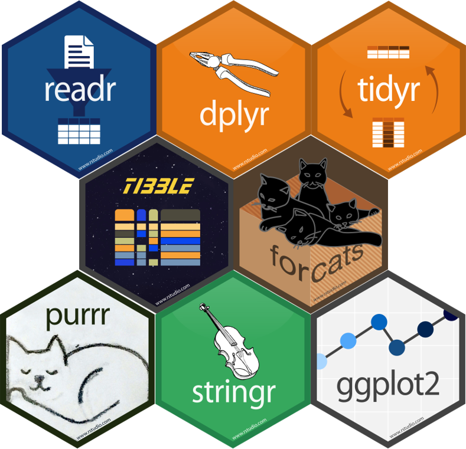

class: inverse

background-image: url(../slides/images/better_data_cleaning_splash_slide_section_1.png)
background-position: center
background-size: contain
---
class: inverse, center

background-image: url("../slides/images/markus-spiske-iar-afB0QQw-unsplash.jpg")
background-position: center
background-size: contain

```{r setup, include=FALSE}
options(htmltools.dir.version = FALSE)
library(here)
library(snakecase)
library(DT)
library(kableExtra)
```

???

Image credit: [Unsplash]https://unsplash.com/photos/gcgves5H_Ac)

<span>Photo by <a href="https://unsplash.com/@markusspiske?utm_source=unsplash&amp;utm_medium=referral&amp;utm_content=creditCopyText">Markus Spiske</a> on <a href="https://unsplash.com/s/photos/matrix-code?utm_source=unsplash&amp;utm_medium=referral&amp;utm_content=creditCopyText">Unsplash</a></span>
---
class: inverse
name: outline

## Outline

  1. [Data Cleaning](#datacleaning)
  2. [Tidyverse](#tidyverse)
  3. Data Profiling
    * [Numerical Data](#numericaldata)
    * [Categorical Data](#profilecategorical)

---
class: inverse

## Prerequistes

  - R is installed
  - RStudio is installed
  - download the workshop materials
    * [https://github.com/Standard-Deviator/CPA_2020_data_cleaning_tidyverse](https://github.com/Standard-Deviator/CPA_2020_data_cleaning_tidyverse)
  - open "CPA_2020_data_cleaning_tidyverse.Rproj" to launch Rstudio
  - the following packages are installed

``` {r install_packages, eval=FALSE}
install.packages(c("tidyverse", "here","snakecase"))    
```

You can learn more about R projects at [https://support.rstudio.com/hc/en-us/articles/200526207-Using-Projects](https://support.rstudio.com/hc/en-us/articles/200526207-Using-Projects).

---
class: inverse
name: datacleaning

## What is Data Cleaning?

--

> "Data cleansing or data cleaning is the process of detecting and correcting (or removing) corrupt or inaccurate records from a record set, table, or database and refers to identifying incomplete, incorrect, inaccurate or irrelevant parts of the data and then replacing, modifying, or deleting the dirty or coarse data"

.right[Wikipedia]

--

>It is often said that 80% of data analysis is spent on the process of cleaning and preparing the data

.right[Dasu and Johnson, 2003]

--

>Garbage in, garbage out.

.right[Depends on who you ask, mid 20th century?]
???

Dasu, T., & Johnson, T. (2003). Exploratory data mining and data cleaning (Vol. 479). John Wiley & Sons.

Wu, S. (2013), "A review on coarse warranty data and analysis" (PDF), Reliability Engineering and System, 114: 1–11, doi:10.1016/j.ress.2012.12.021

---
class: inverse
name: tidyverse

.hex-sticker[]

## What is the Tidyverse?

>The tidyverse is an **opinionated** collection of R packages designed for data science. All packages share an underlying design philosophy, grammar, and data structures.

.right[www.tidyverse.org]

--

  * There is nothing that can be done using the tidyverse which cannot be accomplished using base R or other packages. 
  * I prefer these packages because I found a significant leap forward in the robustness of my code, quicker debugging time, and quicker to perform checks on my data.
  
---
class: inverse

.pull-left[


]

.pull-right[
.middle[
Further, I recommend the book *R for Data science* which is freely available online at https://r4ds.had.co.nz/
]
]
---
class: inverse

.hex-sticker[]

## What is the Tidyverse?

The packages within the tidyverse are categorized into two parts: 8 *core* packages and 15 *non-core* packages.

There is a higher level management package called *tidyverse* which helps maintain the whole collection of packages. All 23 packages can be installed with a single function.

```{r eval=FALSE}
install.packages("tidyverse")
```

---
class: inverse

.hex-sticker[]

## The Tidyverse

The core packages are likely to be used each time you sit down to write code, and loading *JUST* the core 8 packages can be done with a single function.

```{r load_tidyverse, warning=FALSE}
library(tidyverse)
```

--

???

A nice thing to note here is that once the *tidyverse* package is loaded, it explicitly tells you that the core 8 packages are attached. It also supplies a message about which functions are now masked by the newly loaded package functions.

Tip: At anytime, you can run the function `tidyverse_conflicts()` to see the message again.

---
class: inverse

.hex-sticker[]

## Tidyverse: Core Packages

.middle[.center[.img-fill-50[]]]

---
class: inverse

## Dplyr

.hex-sticker[]

Dplyr provides a simple set of “verb” functions that make basic data manipulation easier:
  * <mark>`filter()`</mark>
    * creates a subset of the data by extracting rows which meet certain criteria
--
  * <mark>`select()`</mark> 
    * creates a subset of the data by extracting a set of columns we identify by name  
--
  * <mark>`mutate()`</mark>
    * creates/transforms variables using pre-existing variables and adds them to the end of our tibble
--
  * <mark>`group_by()`</mark>
    * adds grouping meta-data to the data
--
  * <mark>`summarise()`</mark>
    * applies summary functions to columns in our data and returns a tibble of the results
---
class: inverse

background-image: url(https://d33wubrfki0l68.cloudfront.net/db69c3d03699d395475d2ac14d64f611054fa9a4/e98f3/wp-content/uploads/2018/08/data-transformation.png)
background-position: center
background-size: contain


---
class: inverse

## Dplyr

.hex-sticker[]

This link will download the cheat sheet:

https://www.rstudio.org/links/data_transformation_cheat_sheet

This link has all of the help documentation and listing of available funcions:

https://www.rdocumentation.org/packages/dplyr/versions/0.7.8

---
class: inverse

## Magrittr

.hex-sticker[]

The pipe operator `%>%` is a very useful way of writing human-readable code, while avoiding intermediate objects within R to hold results.

This operator can be read as the phrase "and then...". It takes the results from the left side of the operator and inserts it as the <mark>FIRST</mark> argument of the right side of the operator.
.pull-left[
```{r, eval = FALSE}
# original function call
f(x,y)
# becomes
x %>% 
  f(y)
```
]

.pull-right[
``` {r, eval = FALSE}
# original function call
filter(mtcars, cyl == 4)
# becomes
mtcars %>% 
  filter(cyl == 4)
```
]
--

There is a keyboard shortcut in RStudio to insert the pipe operator
ctrl+shift+m or cmd+shift+m
???

Tab completion for variable names

Can chain as many functions together as you would like. Though if the chain grows to more than a sequence of 10, it is recommended to save the results as an intermediate object and begin a new chain.

If you need to pipe the leftside of the operator into another argument, use the `.` placholder

---

class: inverse

.hex-sticker[]

## Data Cleaning/Cleansing

--

Data Quality can be broken down into a few categories:
  * Validity
    * In the sense of either valid or invalid, and not the degree to which a measurement corresponds to a true (possibly unknown) value.
      * What is your first name? 3 would not be a valid response
--
  * Accuracy
    * This is what psychologists typically refer to as validity or closeness of a value to a known standard or true value.
--
  * Completeness
    * The degree to which all required measures are known.
    * For us, this pertains to missing data
--
  * Consistency
    * Pertains to incompatabilities within the data itself or as can be corroborated with other existing data
--
  * Uniformity
    * Are all the values within a set of measures specified using the same units of measurement (inches vs cm)

???

Helpful blog which provides a great summary and description of data cleaning
https://towardsdatascience.com/the-ultimate-guide-to-data-cleaning-3969843991d4

Wikipedia entry which the blog was based upon
https://en.wikipedia.org/wiki/Data_cleansing

---
class: inverse

## Data-Profiling

Data-profiling is a technique for getting to know data at a deeper level. It consists of a series questions and checks we perform as we explore the data and see whether certain constraints were met.

We can do this using descriptive statistics and/or visualizations.

We will use both!

???

Data cleaning and profiling is an iterative process
  * We won't get everything right the first time around
  * We might improve or find a better way
  * There isn't always a clear place to start, but we have to start somewhere

---
class: inverse

## Data-Profiling: Goal

Identify problems/issues present within a dataset

--

  1. Fix it!
    * Refer to original material or codebook to help resolve the problem.
--
    * Contact participants to verify response (not usually possible).
--
    * Infer correct values.
      * Typos might seem harmless, but there could be ambiguous problems: "malle" or "fmale"
--
  2. Ignore it!
    * We flag a value as missing (`NA`) so that R treats it appropriately.
--
  3. We impute a sensible guess as to what the value could be.
    * Section 3 of this workshop will walkthrough profiling a dataset for missingness, but not imputation methods (I do recommend using the mice package)

???
  1. Fix it!
    * Refer to original material or codebook to help resolve the problem.
    * Contact participants to verify response (not usually possible).
    * Infer correct values.
      * Typos might seem harmless, but there could be ambiguous problems: "malle" or "fmale"
  2. Ignore it!
    * We flag a value as missing (`NA`) so that R treats it appropriately.
  3. We impute a sensible guess as to what the value could be.
    * This will be treated in full later in this workshop.

**Each time we fix something we will update our "cleaning_script.R" file**
We are going to use a clean-as-we-go strategy

* **CAUTION**: be very careful of any corrections you make to a data set. It is recommended to keep an unchanged copy of the original data at a separate location.
---
class: inverse

## Data-Profiling: Goal

A problem that often occurs at this point is understanding what to look for within our data.

--

What constitutes a problem that needs to be addressed?

--

How do we know that we found them all?

--

Our goal is to have our data be as error-free and internally consistent as possible.

--

We have to start somewhere, so generally I start looking at numerical data first, and the categorical data after (we might also want to look at both types simultaneously too).

---
class: inverse
name: numericaldata

## Data-Profiling: Numerical Data

Different types of data require us to ask different questions.

  * Is a variable meant to be a unique identifier?
    * Like a participant ID

--

  * Is there a valid range?
    * (upper or lower boundaries)

--

  * Can there be decimals?
    * (or what level of precision)

--

  * Do the values make "sense" regarding the scale of measurement?
    * e.g., A height of 6' seems plausible, but a height of 6 meters does not.

--

  * Were missing values coded properly?

---
class: inverse

## Let's Profile Some Data

The dataset we will use in this section of the workshop is a publicly available dataset.

I believe it serves a few purposes for us:
  * You might not have substantive knowledge of superheros, but the principles and techniques we discuss can be helpful anyway.
  * This puts a stronger emphasis on the data-profiling aspect of the cleaning process
  * Sometimes we might be "too" familiar with our data and miss things
  
---
class: inverse

.hex-sticker[]

## Importing Data

```{r import_csv}
data_superhero <- read_csv(file = here("data",
                                       "heroes_information.csv"))
```
--
```{r eval=FALSE}
spec(data_superhero)
```

--
.hex-sticker[]
???

I prefer the `readr` package when importing "flat" data. It provides instant feedback on the data-constraints imposed for each column, displays a progress bar for long import times, and provides feedback on the type constraints imposed on your data.

Note that many tidyverse functions replace base R functions by substituting a '_' in place of a "."

Notice that we get a read-out of how `R` parsed the data it found within the csv file.
We also get warnings of some other problems.

---
class: inverse

## Importing Data: Consistent Variable Names

There are two things that I notice with the feedback provided by the `read_csv()` function:

  1. The first variable does not have a name, so a rather uninformative name is given `X1`
  2. Some of the variable names start with Capitol letters and some Have spaces


???
I prefer snake_case because it is human-readable and machine readable too!!!!!
---
class: inverse

.hex-sticker[]

# X1?

Let's take a peak at the mysterious variable `X1`

```{r check_out_x1, highlight.output=c(3)}
glimpse(data_superhero)
```
--
```{r}
n_distinct(data_superhero$X1)
```
---
class:inverse

## Unique Constraints

--

A unique constraint is a restriction imposed on a variable to allow for a particular observation unit to be identifiable and distinct from all other observational units.

In other words each value in this variable <mark>MUST</mark> be associated with one (and only one) observation.

One of the main uses of this type of constraint is unique identifiers for each subject of analysis to prevent spill-over or contamination.

--

For instance, each subject should have their own ID such that all data are properly attributed to that subject.

Same goes for structurally nested data like education data where students are studied within classrooms, with schools.
Each individual subject should be have a unique identifier, each classroom, and each school.

???
Some functions within R might require such a variable in order to run an analysis (such as repeated-measures, or longitudinal analyses).

They can also be immensely useful for merging data sources together (more on this later).

---
class: inverse

.hex-sticker[]

# Rename X1 to Something Usefull

We can add to our data pipeline a function to rename the `X1` variable to "`id`"

```{r eval = FALSE}
# Import data using a relative file path
data_superhero <- read_csv(file = here("data",
                                       "heroes_information.csv")) %>% 
  # rename the first column as "id"
  rename("id" = X1)             #<<
```
--
.hex-sticker[]
---
class: inverse
.hex-sticker[]

## Pro-tip: Unique Identifiers

If the data set does <mark>NOT</mark> have a unique identifier for each row (or these identifiers are stored as row names), then I highly recommend you create one.

```{r row_names, eval=FALSE}
data_superhero %>% 
  rownames_to_column(var = "id") #<<

# or
data_superhero %>% 
  add_column(id = 1:nrow(data_superhero), #<<
             .before = 1) #<<
```

I prefer the first because row names in `R` are already constrained to be unique.

---
class: inverse

## Pro-tip: Naming Conventions

Whenever you are creating a name for something in R. BE CLEAR AND DESCRIPTIVE.

I highly recommend following a style guide.

https://style.tidyverse.org/

https://google.github.io/styleguide/Rguide.html

I use snake_case because I find it to easier to read, and it has the added benefit of being machine readable

``` {r snake_case_demo, eval=FALSE}
# which do you prefer
variable1
variable_1

anxiety_scale_item_1 # snake_case #<<
anxietyscaleitem1
anxietyScaleItem1 # camelCase
```

---

class: inverse

## Importing Data: Consistent Variable Names

```{r fix_var_names, message=FALSE, warning=FALSE}
# Import data using a relative file path
data_superhero <- read_csv(file = here("data",
                                       "heroes_information.csv")) %>% 
  # rename the first column as "id"
  rename("id" = X1) %>%
  # rename variables to make them easier to use
  rename_with(.fn = snakecase::to_snake_case)             #<<
```

```{r check_fixed_names}
# check that names were fixed properly
colnames(data_superhero)
```
--
.hex-sticker[]
---
class: inverse
.hex-sticker[]

## Importing Data: Data-Type Constraints

Data-type constraints is next thing I check once I load data into R.

--

The readr package uses the first 1000 rows in a dataset to guess the most appropriate atomic type for each column in your dataset (they can be changed later):
  * character
    * "hello world"
  * double
    * 3.1459
  * integer
    * 4L
  * logical
    * TRUE, FALSE

???

A data.frame/tibble can be thought of as a way of storing your data which retains important structural information. Each row is a single observational unit, and each column tracks some attribute (quantitative or qualitative) about that observational unit. For instance, each row could be a subject within a study, and each column would be a measured/observed quality pertaining to that subject (like first name, student id, etc.).

---
class: inverse

## I got 99 `problems()`, but Parsing ain't One

If `read_csv()` encountered parsing problems, it prints a warning to the console.

--

You can also extract and `View()` the problems using the following code.

```{r eval=FALSE}
# examine parsing problems in R's data viewer
problems(data_superhero) %>% #<<
  View()
```

```{r eval=TRUE,echo=FALSE}
# examine parsing problems in R's data viewer
problems(data_superhero)
```
---
class: inverse

## Data Profiling: Numerical Variables

Now that the variable names have been fixed, we can start profiling our data.

Data cleaning is often an iterative process. You might uncover a problem that needs to be addressed before you finish fixing the problem you started to clean.

--
Let's start by taking a quick peak at our data

```{r glimpse_the_data,highlight.output=c(9, 13)}
glimpse(data_superhero)
```

---
class: inverse

## Range Constraints

--

Range constraints require a little more thought. It all depends on knowing your data, and cleaning your data essentially is getting to know your data in greater detail to be able to make informed decisions about problems.

For instance, if you have data which represents counts of things (e.g., number of symptoms, cigarettes smoked within a certain time frame), these can be checked by you.

Likewise, some variables cannot take on negative values as their scale of measurement renders negative values non-sensical (e.g., heights and weights). Even a value of zero might not be a valid value to observe.

Sometimes, variables might have a valid lower boundary, upper boundary, or both.

---

class: inverse

## Example of Lower Boundary Constraints

Check for "out-of-range" heights and weights. 

```{r eval = FALSE,results='hide'}
# This checks for any row with EITHER a weight <= OR a height <= 0
data_superhero %>% 
  filter(weight <= 0 | height <= 0) %>%       #<<
  View()

# This checks for any row with BOTH a weight <= and a height <= 0
data_superhero %>% 
  filter(weight <= 0,                    #<<
         height <= 0) %>%                #<<
  View()
```

???

Remember, <mark>ALWAYS</mark> check that R is answering the question you think you asked

  1. I am not saving the results from this code into an object
    * I just want to see what the results look like
  2. I am piping the results into the View() function to use R's data viewer to inspect the results
  3. Getting the correct boolean logic statements can be tricky, so play around. These pipes DON'T affect our data in any way.
---
class: inverse

.hex-sticker[]

## Example of Boundary Constraints

Dplyr has a `between()` function which can be helpful when used in conjunction with the negation operator <mark>`!`</mark>

```{r}
# What if we were to assume that any height larger than 300cm is abnormally large?
data_superhero %>% 
  filter(!between(x = height, #<<
                 left = 0,
                 right = 300))
```

--

We could insert code similar to this into our chain, but I recommend not subsetting out whole rows of code at this point. This is akin to list-wise deletion. Many modeling functions in R will perform listwise deletion automatically (unless you tell it otherwise). Depending on how you want to handle missing our outlying or influential cases, you might need to retain as much of your data as possible.

---
class: inverse

.hex-sticker[]
## Range Constraints

.pull-left[
```{r eval=FALSE}
p <- data_superhero %>% 
  ggplot(aes(x = height)) + 
  geom_histogram(bins = 20) +
  geom_vline(aes(xintercept = 0),
             color = "red")

plotly::ggplotly(p)
```

  * Start with the data, then ...
  * create a canvas with height on the x-axis, then ...
  * generate a histogram, then ..
  * add a vertical line at my boundary constraint
]

.pull-right[
```{r echo=FALSE,message=FALSE,warning=FALSE,out.width="400px",out.height="400px"}
p <- data_superhero %>% 
  ggplot(aes(x = height)) + 
  geom_histogram(bins = 20) +
  geom_vline(aes(xintercept = 0),
             color = "red")

plotly::ggplotly(p)
```
]

---
class: inverse
.hex-sticker[]

## Range Constraints

.pull-left[
```{r eval=FALSE}
p <- data_superhero %>% 
  ggplot(aes(x = weight,
             y = height)) + 
  geom_point() +
  geom_hline(yintercept = 0,
             color = "red") +
  geom_vline(xintercept = 0,
             color = "red")
plotly::ggplotly(p)
```
  * Start with the data, then ...
  * create a canvas with height on the y-axis and weight on the x-axis, then ...
  * generate a scatterplot, then ..
  * add a vertical and horizontal lines at my boundary constraints
]

.pull-right[
```{r echo=FALSE, message=FALSE, warning=FALSE,out.height="400px",out.width="400px"}
p <- data_superhero %>% 
  ggplot(aes(x = weight, y = height)) + 
  geom_point() +
  geom_hline(yintercept = 0, color = "red") +
  geom_vline(xintercept = 0, color = "red")

plotly::ggplotly(p)
```
]

---
class: inverse

.hex-sticker[]

## We found a problem, now what?

We know that we have cases with negative `height` and `weight`, so what should we do about?

--
```{r examine_neg_height_values}
# examine negative or zero height values
data_superhero %>%     
  filter(height <= 0) %>%       #<<
  count(height)#<<

# examine negative or zero weight values
data_superhero %>%     
  filter(weight <= 0) %>%       #<<
  count(weight)#<<
```
---
class: inverse

.hex-sticker[]

## We found a problem, now what?

That suspicious value of -99 was probably a way of encoding missing data, so we should update our cleaning script with two things.

  1. We insert our `mutate()` we just created into our data pipeline (even if the negatives will be gone soon)
    * Remember to invert the operators to exclude the negative values
  2. We should convert these values into `NA` so that R treats them appropriately.
  
```{r fix_missing_height_weight_echo, eval = FALSE}
data_superhero %>% 
  mutate(height = na_if(height, y= -99), #<<
         weight = na_if(weight, y = -99)) %>%  #<<
  View()
```
.hex-sticker[]
---
class: inverse

.hex-sticker[]

## Was the problem fixed?

```{r fix_missing_height_weight_eval, echo = FALSE,highlight.output = c(8,10)}
data_superhero %>% 
  mutate(height = na_if(height, y= -99),
         weight = na_if(weight, y = -99))
```

---
class: inverse

.hex-sticker[]

## Pro-Tip: Multiple Mutates

Mutate if a column meets a particular criterion
```{r pro_tip_mutate_if, eval=FALSE}
data_superhero %>% 
  # replace -99 with NA for all double variables
  mutate_if(.predicate = is_double,
            .funs = na_if,
            y = -99)
```

Mutate at all specific columns

```{r pro_tip_mutate_at, eval=FALSE}
data_superhero %>% 
  # replace -99 with NA for all double variables
  mutate_at(.vars = vars(weight,height),
            .funs = na_if,
            y = -99)
```
---
class: inverse

.hex-sticker[]

## Our Data Pipeline So Far

```{r current_pipeline_1, eval=FALSE}
# Start by importing the data
# I'm using the here::here() function to make the file path relative to the project directory
data_superhero <- read_csv(file = here("data",
                                       "heroes_information.csv")) %>% 
  # rename the first column as "id"
  rename("id" = X1) %>% 
  # rename variables to make them easier to use
  rename_with(.fn = to_snake_case) %>% 
  # replace -99 with NA
  mutate(height = na_if(height, y= -99), #<<
         weight = na_if(weight, y = -99)) #<<
```

  1. We imported our data (using a relative path), then ...
  2. renamed the `X1` variable to `id`, then ...
  3. fixed variable names, then ...
  4. replaced values of -99 with `NA` for height and weight
---
class: inverse
name: profilecategorical

## Data-Profiling: Categorical Data

  * What are the possible values/levels?
  
    * e.g., Did your study have 4 conditions?
  
--

  * Are there more groups than you expected?

--

  * Should some "groups" be recast as a single group?
    * e.g., similarly named categories, typos, or conceptually similar groupings

--

  * What proportion of cases are missing across levels of your factors?
---
class: inverse

## What are the possible values/levels?

Categorical data in `R` is called a factor, and each factor should have a known and fixed set of levels.

If you know how many levels you have, then we can explicitly coerce one of our character vectors into a factor.

For example, if you designed an experiment with low, medium, and high stress conditions, then you should have a factor with only three levels.

In essence, we are saying that each subject belongs to a particular category.

---
class: inverse

.hex-sticker[]
# Prepping Categorical Data

For <mark>some</mark> categorical data we want to remove accidental groups in data that could be the result of typographical or data-entry errors.

Consider the following chunk of code:
```{r factor_example, highlight.output=c(2)}
# create example data
undergrad_year <- c("First","Second","Third","second")

# convert to a factor without explicitly setting the levels
undergrad_year_fct <- parse_factor(undergrad_year)
undergrad_year_fct
```

  
We want to be sure that when we clean up certain variables, we are not losing potentially important aspects of our data.

So, let's take a peak at our data to determine which variables should be cleaned to prevent case-sensitivity related errors.

---
class: inverse

## Checking out our data

Our data set has 8 categorical variables, some of them fall easily into having known and fixed sets of levels (alignment), while others could have quite a few unforeseen levels (`gender`, `eye_color`, `race`, `hair_color`, `publisher`, `skin_color`, and `alignment`)

I also opted to not alter the `name` variable (we might lose proper spelling).

```{r check_cat_variables, highlight.output=c(5:8,10:12)}
glimpse(data_superhero)
```
???
I think about this selection process like this, would I want to group my data later on  by this variable.
Grouping the data by everyone with the name "A-bomb" probably won't help us. But grouping by race, gender, or even skin-color could be helpful for graphs and analyses later on.

---
class:inverse

## Cleaning Character Data

Cleaning up leading and trailing whitespace

```{r white_space_example}
# whitespace changes the data
" hi" == "hi"

# case sensitivity matters
"Hi" == "hi"
```

One nice thing about R and the readr package, is that it automatically trims the leading and trailing whitespace from your data.

We can clean up our character data using the stringr package.
---
class: inverse
.hex-sticker[]

## Cleaning Character Data

Before we clean up character data, we need to carefully consider whether the action we take cleaning could result in a loss of information.

```{r convert_char_to_lower_code}
data_superhero %>% 
  mutate_at(.vars = c("gender", "eye_color", "race",
                       "hair_color", "skin_color",
                       "alignment", "publisher"),
            .funs = str_to_lower) %>% #<<
  glimpse()
```

```{r convert_char_to_lower_hide, echo=FALSE}
data_superhero <- data_superhero %>% 
  mutate_at(.vars = c("gender", "eye_color", "race",
                       "hair_color", "skin_color",
                       "alignment", "publisher"),
            .funs = str_to_lower)
```
--
.hex-sticker[]
---
class: inverse

.hex-sticker[]

## Profiling Categorical Data

So far we have cleaned/checked `id` and opted to leave `name`, let's continue by taking a peak at `gender` and `alignment`.

.pull-left[
```{r profile_gender, highlight.output=c(4)}
fct_count(data_superhero$gender)
```
]
.pull-right[
```{r profile_alignment, highlight.output=c(4)}
fct_count(data_superhero$alignment)
```
]

There is a bizarre category with a value of "-", this probably indicates missing data for the character data within our dataset.

So let's go back to our cleaning script and slightly alter the `read_csv()` function.
---
class:inverse

## Missing Character Data

The `read_csv()` function has many additional arguments which can alter how the data is imported into R.

We can automatically insert NA values when it encounters specific character values via the "na" argument.

```{r read_csv_missing_values, eval=FALSE,message=FALSE, warning=FALSE}
data_superhero <- read_csv(file = here("data",
                                       "heroes_information.csv"),
                           na = c("NA","","-",".")) #<<
```

```{r update_code, echo =FALSE,message=FALSE,warning=FALSE}
# Rereun the cleaning script thus far
data_superhero <- read_csv(file = here("data",
                                       "heroes_information.csv"),
                           na = c("NA","","-",".")) %>%
  # rename the first column as "id"
  rename("id" = X1) %>%
  # rename variables to make them easier to use
  rename_with(.fn = to_snake_case) %>%
  # replace -99 with NA
  mutate(height = na_if(height, y= -99),
         weight = na_if(weight, y = -99)) %>%
  # convert all character vectors (except name)
  # into lower case
  mutate_at(.vars = c("gender", "eye_color", "race",
                      "hair_color", "skin_color",
                      "alignment", "publisher"),
            .funs = str_to_lower)
```
--
.hex-sticker[]
---
class: inverse

.hex-sticker[]

## Explicit Coercion

If you want more control over the coercion of your data into other atomic types or objects, then I recommend building a chain of functions. Testing each as you go along.

I recommend the `readr::parse_*()` functions for coercion.

```{r parse_factor_example, highlight.output=c(2)}
data_superhero <- data_superhero %>% 
  mutate(gender_fct =  parse_factor(gender,
                                levels = c("female","male")),
         alignment_fct = parse_factor(alignment,
                                      levels = c("good","neutral","bad")))
```

```{r parse_factor_example_problem,results='hide'}
# example of values with no level for them to belong to
parse_factor(c("male","m","female"),
             levels = c("male","female"))
```

???
As a side, note we will cover what to do if you don't know all of the levels in advance and you want R to figure it out for you.

---
class: inverse

## Reminder: `problems()`
.hex-sticker[]

Keep in mind that `problems()` comes from the readr package, so it only tracks problems from importing functions using the form `readr::read_*()` or coercion functions using the form `readr::parse_*()` from the readr package.
``` {r eval= FALSE}
# check the whole dataset for parsing problems arising form import
problems(data_superhero)

# check a single variable after using a parse_*() function for exlplicit coercion
problems(data_superhero$gender_fct)
```

---
class: inverse

.hex-sticker[]

## `eye_color`

Let's keep going to see what else we can discover through profiling our data .

```{r explore_eye_color_code_1, eval=FALSE}
fct_count(data_superhero$eye_color) %>% 
  arrange(f) %>%
  View()
```


```{r explore_eye_color_code_2, echo=FALSE}
fct_count(data_superhero$eye_color) %>% 
  arrange(f)
```

---

.hex-sticker[]

## `eye_color`

```{r explore_eye_color_result, echo = FALSE}
fct_count(data_superhero$eye_color) %>% 
  arrange(f) %>%
  datatable(fillContainer = FALSE,
                options = list(pageLength = 10))
```

---
class: inverse

## Visualize `eye_color`

```{r echo=FALSE}
fct_count(data_superhero$eye_color) %>% 
  arrange(f) %>% 
  ggplot(aes(x = f, y = n)) +
  geom_col() +
  coord_flip() +
  theme(text = element_text(size = 18))
```

---
class: inverse

## Edit `eye_color`
.hex-sticker[]

```{r fix_bown_eye_color, highlight.output=c(1)}
# replace all instances of "bown" eye_color with "brown"
data_superhero %>% 
  mutate(eye_color =  if_else(condition = eye_color == "bown",#<<
                              true = "brown",#<<
                              false = eye_color))  %>% #<<
  # Check that there are no cases of "bown" remaining 
  filter(eye_color == "bown")
```
  1. Start with our Cleaned (so far) data, then ...
  2. `mutate()` the `eye_color` variable, then ...
    * check each value of eye_color check if our condition is true
      * If true, then replace that value with "brown"
      * If false, keep the original value of `eye_color`
  3. keep only the rows for superheroes with an eye_color exactly equal to "bown"

---
class: inverse

## Visualize `skin_color`

.pull-left[
```{r eval=FALSE}
p <- fct_count(data_superhero$skin_color) %>% 
  arrange(f) %>% 
  ggplot(aes(x = f, y = n)) +
  geom_col() +
  coord_flip() +
  theme(text = element_text(size = 18))

# generate interactive plot
plotly::ggplotly(p)
```
]

.pull-right[
```{r echo=FALSE,out.height="450px",out.width="350px"}
p <- fct_count(data_superhero$skin_color,) %>% 
  arrange(f) %>% 
  ggplot(aes(x = f, y = n)) +
  geom_col() +
  coord_flip() +
  theme(text = element_text(size = 18))

# generate interactive plot
plotly::ggplotly(p)
```
]
???
I have found that frequently, there are many more levels to a factor than I anticipated, so rather than examining a table I prefer to visually assess the levels and their frequencies within my dataset. But the missing data still obscures the lower counts.
---
class: inverse

## Visualize `skin_color`
.hex-sticker[]

.pull-left[
```{r eval=FALSE}
p <- fct_count(data_superhero$skin_color) %>% 
  arrange(f) %>% 
  tidyr::drop_na(f) %>% #<<
  ggplot(aes(x = f, y = n)) +
  geom_col() +
  coord_flip() +
  theme(text = element_text(size = 18))

# generate interactive plot
plotly::ggplotly(p)
```
Let's try again, but let's insert another function from the tidyr package to drop rows which have a missing level.
]

.pull-right[
```{r echo=FALSE,out.height="450px",out.width="350px"}
p <- fct_count(data_superhero$skin_color,) %>% 
  arrange(f) %>% 
  drop_na(f) %>% #<<
  ggplot(aes(x = f, y = n)) +
  geom_col() +
  coord_flip() +
  theme(text = element_text(size = 18))

# generate interactive plot
plotly::ggplotly(p)
```
]
???
Note that the missing data have not been removed from our cleaned data set, there were only omitted for this plot
---
class: inverse

## Edit `skin_color`
.hex-sticker[]

```{r fix_gray_skin_color}
# replace all instances of "gray" skin_color with "grey"
data_superhero %>% 
  mutate(skin_color =  if_else(condition = skin_color == "gray", #<<
                              true = "grey",#<<
                              false = skin_color)) %>% #<<
# Check that there are no cases of "gray" remaining
  filter(skin_color == "gray")
```

--
.hex-sticker[]

---

## `hair_color`

```{r count_hair_color,echo=FALSE}
fct_count(data_superhero$hair_color) %>% 
  arrange(f) %>%
  datatable(fillContainer = FALSE,
                options = list(pageLength = 7))
```

I will leave the `hair_color` variable as an exercise.

---
class: inverse

## Visualize `publisher`

```{r echo=FALSE}
p <- fct_count(data_superhero$publisher) %>% 
  arrange(f) %>% 
  ggplot(aes(x = f, y = n)) +
  geom_col() +
  coord_flip() +
  theme(text = element_text(size = 18))

# generate interactive plot
plotly::ggplotly(p)
```
---
class: inverse

## Structural Missingness

These are values that should be missing in your data set dependent on the structure of our data set.

For instance, imagine a questionnaire which asked for the marital status of a subject, and the subsequent question asked, if you answered "married", then how long have you been married?

If you didn't answer married, then you must have a missing answer here.

```{r eval = FALSE}
survey_data %>% 
  filter(married == TRUE,
         !is.na(joint_income)) %>% 
  View
```

---
class: inverse

## Mandatory Constraints

In a nutshell, this pertains to variables in your data which <mark>MUST NOT</mark> be missing. For instance, subject/participant numbers, and key variables for modelling should all be present.

Constraints can be univariate (like an ID variable) or multivariate (like an ID variable, and multiple time-points)

---
class: inverse

## Take Home Message

  * Cleaning your data can still be a time consuming (but important) endeavour.
    * Care must be taken at each step to ensure that our data is as error-free as possible
  * There isn't a definitive checklist for data quality, but there are some things to look for depending on the type of data you are dealing with.
  * Know what to look for takes practice, and the R code presented today should hopefully speed up your data cleaning
  * Remember, cleaning can be an iterative process.
    * Each error you fix has the potential to uncover another previously obfuscated errors.


---
class: inverse

## Pro-tip

Check out the tidylog package!