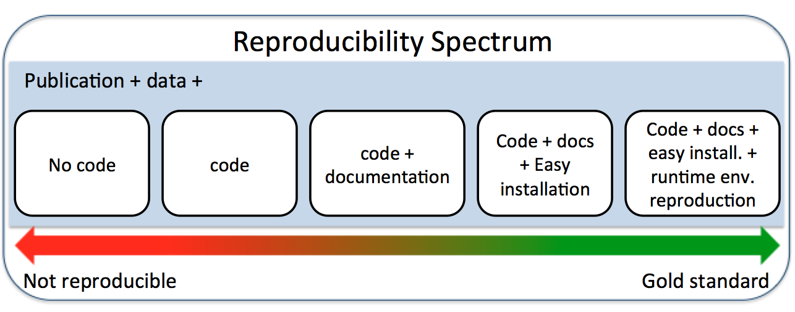
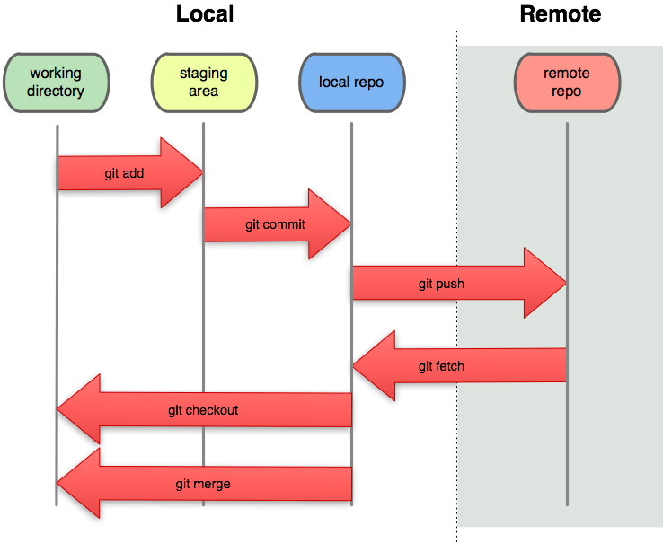
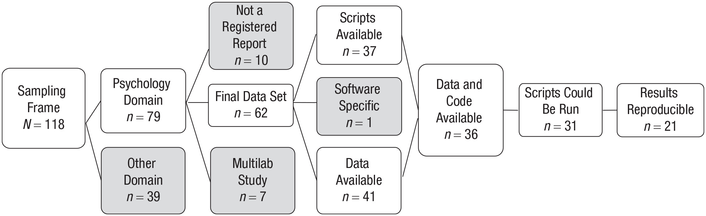

class: inverse, center

background-image: url(../slides/images/small_steps_towards_reproducible_data_analyses_splash_slide.png)
background-position: center
background-size: contain

```{r setup, include=FALSE}
options(htmltools.dir.version = FALSE)
library(here)
library(kableExtra)
```
???

## Main goal for this workshop

Making one's own research reproducible can often involve learning new and complex technologies. What I offer in this workshop is a broad overview of some of the things out there and how they can be used in every day practice.

My advice is to use the resources listed here and either get your lab mates or a small study group and try to work through the examples.

We learn by doing, but the the doing part can be very hard. Don't give up. Keep pushing!
<link href="/extra.css" rel="stylesheet" type="text/css">
---
class: inverse

background-image: url(../slides/images/antonin-allegre-iCdqTGK8wvw-unsplash.jpg)
background-size: contain
## Outline

  1. [Definitions](#reprodef)
  2. [Goals](#goals)
  3. [Version Control via Git](#git)
  4. [Codebook](#codebook)
  5. [Package Management](#renv)
  7. [Take Home Message](#takehome)
  6. [Resource Links](#resources)

???
<span>Photo by <a href="https://unsplash.com/@antoallegre?utm_source=unsplash&amp;utm_medium=referral&amp;utm_content=creditCopyText">Antonin ALLEGRE</a> on <a href="https://unsplash.com/s/photos/presentation-outline?utm_source=unsplash&amp;utm_medium=referral&amp;utm_content=creditCopyText">Unsplash</a></span>
---
class: inverse
name: reprodef

## Reproducible: Definition

--

.center[
.middle[

]
]

.footer[
https://the-turing-way.netlify.com/reproducibility/03/definitions.html
]

???

To avoid ambiguity, I will use the term computational reproducibility
---
class: inverse
name: goals

## Reproducible: Goal 1

.hex-sticker[]
.footer[https://ropensci.github.io/reproducibility-guide/sections/introduction/]

<mark>"Show evidence of the correctness of your results"</mark>
  
  * In principle, our manuscripts and peer-reviewed articles should be sufficient for reproducing our results
  
  * A methods section is supposed to be a blueprint or protocol outlining the sufficient and necessary steps to arrive at the same analytic results
    * There may be word limits
    * We may omit something that seems harmless, but prevents our analysis from being reproduced

--

  * Adds much needed transparency and credibility to our analytic results and conclusions based upon these results

---
class: inverse

## Reproducible: Goal 2

.hex-sticker[]
.footer[https://ropensci.github.io/reproducibility-guide/sections/introduction/]

<mark>"Enable others to make use of our methods and results"</mark>
  
  * For science to be cumulative, others need to be able to access and understand the resources we are sharing.
  
--

  * There is baseline level of research quality which must be first established prior to other researchers using our methods or results.
  
--

  * This also imporves the longevity of our research.
    * The effort we put it in now, greatly increase the usefulness of our work into the future by increasing the likelihood that our analyses will still run.

--

There are many reasons that a study might not replicate, but there should never be a reason that it cannot be computationally reproduced.

---
class: inverse

## Computational Reproducibility

--
.center[
.middle[
  
]]


.footer[
https://towardsdatascience.com/scientific-data-analysis-pipelines-and-reproducibility-75ff9df5b4c5
]

???
The main thing I want to get across here is that there is a gradient, and there are little things every researcher can do to improve the computational reproducibility of your own work.

---
class: inverse
name: git

## Pre-publication: Version Control

> "Version control is a system that records changes to a file or set of files over time so that you can recall specific versions later."

Many cloud based storage repositories use version control.
  * Revert to previous versions of a file
  
  * What is often missing is important differences between versions
    * It can be hard to remember when a change was made or whether you made the change between the 14th or 27th version of your manuscript.

.footer[https://git-scm.com/book/en/v2/Getting-Started-About-Version-Control]
---
class: inverse, middle, center

```{r, out.height = "600px",echo = FALSE}
knitr::include_graphics("http://phdcomics.com/comics/archive/phd101212s.gif")
```

---
class: middle, center

background-color: #a7aaad
## Git Basics

```{r, out.height = "450px",echo = FALSE}

```

???
Remote Repository: the place where your files live off-site

Local Repository: a local version of your files that are version controlled

Working Directory: This is where the files live on your computer

Staging area: Once you have made changes to a file, you send it to the staging area

Local Repository: You can commit all of the changes currently in the staging area to your local repository. Importantly, you should also create a commit message explaining the "why" behind the changes you made
e.g., add a new feature, assumption checks, changed your statistical model

Remote: Repository, this is the virtual place where your files live.

---
class: inverse, middle, center

background-image: url(https://imgs.xkcd.com/comics/git_commit.png)
background-position: center
background-size: contain

.footer[https://imgs.xkcd.com/comics/git_commit.png]
---
class: inverse

## Reproduciblity Goals

<mark>"Enable others to make use of our methods and results</mark>

--

While these goals are partially achieved by the increase in open access to data and materials evidenced by the increase in [Open Science Framework's badges](https://www.cos.io/our-services/badges) and the journals which offer them, the quality and usability of these resources has room for improvement.

.center[
.middle[

]
]
---
class: inverse

## Open Access to Data and Materials Isn't Enough

 Simply posting your analysis code and data onto an open access repository like the OSF or Dataverse is not enough to ensure computational reproducibility.
 
A recent article by Obels et. al (2020) looked at Registered Reports published between 2014 to 2018 in the psychological literature to assess what current standards and practices look like.

???
Note: the authors themselves point out that their main goal wasn't to estimate the computational reproducibility of psychological registered reports, but to get a sense for what could be improved. They provided four suggestions which I will expand upon

---
class: inverse
## Registered Reports

.center[
.middle[

]
]

.footer[https://www.cos.io/our-services/registered-reports]
---
class: inverse
## Obels et al. (2020)

.middle[


]

---
class: inverse
name: codebook

## Suggestion 1: Adding a Codebook to Data Files

A codebook provides high-level information about the data, which can include summary statistics, distributional information, numerical coding, and meaningful labels.

--

I recommend using the `codebook` package in conjunction with the `labelled` package (both are available via CRAN)

--

Together, these packages allow you to add additional attributes to data.frames which are used during the production of a codebook.

--

One added feature is that these codebooks use JSON-LD (Javascript Object Notation for Linked Datasets) which creates meta-data which is findable using search engines like Google.

---
class: inverse

## Codebook Package: Generate a template


```{r codebook_example, eval=FALSE}
# install the codebook package from CRAN
install.packages(“codebook”)

# create a template markdown file for the codebook
codebook::new_codebook_rmd(filename = "mtcars_codebook")) #<<

# load or create your data set
# I opted to use the name "codebook_data" so that this code is consistent with the tutorial linked at the end
codebook_data <- mtcars
```

By default, the markdown file is placed in your current working directory.

---
class: inverse

## labelled Package: Describe the Variables

Once you open the file, you add a variety of extra information including descriptions of the dataset generally, descriptions of each variable, coding schemes used for each variable, as well meta-data about the dataset itself.

```{r eval=FALSE}
library(labelled)
# Add descriptions for each variable in the mtcars dataset
var_label(codebook_data) <- list(#<<
  mpg = "Miles/(US) gallon.",
  cyl = "Number of cylinders.",
  disp = "Displacement (cu.in.).",
  hp = "Gross horsepower.",
  drat = "Rear axle ratio.",
  wt = "Weight (1000 lbs).",
  qsec = "1/4 mile time.",
  vs = "Engine shape.",
  am = "Transmission type.",
  gear = "Number of forward gears.",
  carb = "Number of carburetors."
)
```
---
class: inverse

## Codebook Package: Value Labels

If your dataset has numerical values with a substantive meaning, you can add labels to each variable.

Note: This could also be accomplished by converting the numerical values into a factor with informative names for each level.

```{r eval=FALSE}
# add variable labels to make the values interpretable
val_labels(codebook_data$vs) <- c("V-shaped" = 0,
                                  "straight" = 1)
val_labels(codebook_data$am) <- c("automatic" = 0,
                                  "manual" = 1)
```

---
class: inverse

## Codebook Package: Meta-data

You can also append meta-data to your dataset
```{r append_meta_data, eval=FALSE}
# description of the dataset
metadata(codebook_data)$description <- "The data was extracted from the 1974 Motor Trend US magazine, and comprises fuel consumption and 10 aspects of automobile design and performance for 32 automobiles (1973–74 models)."

# when was the data collected: ideally in ISO 8601 format
metadata(codebook_data)$temporalCoverage <- "1973/1974"

# citation
metadata(codebook_data)$citation <- "Henderson and Velleman (1981), Building multiple regression models interactively. Biometrics, 37, 391–411."
```

--

For further ideas about important meta-data which should be included and the appropriate tag so that it will be indexed properly can be found at [https://schema.org/Dataset](https://schema.org/Dataset).

---
class: inverse

## Suggestion 2: Annotating Code

Annotating code is perhaps the easiest thing to do, yet hardest thing to remember to do well.

The purpose of annotating (or adding comments to our code) is to help make it clear exactly what each line/section of code supposed to be doing.

This helps when sharing our code as a researcher who is not familiar with a particular function or tricky bit of code can understand it.

This also helps you find errors in your own work.

---
class: inverse

## Tip 1

Create sections that match up with your manuscript.

  * if you have multiple studies, then either create separate script files or sections to make it easier to find the code that generated a specific result
  * Even if out think something is clear, spell it out in full
  
```{r}
# ran a linear regression
model_mpg <- lm(formula = mpg ~ cyl + hp + am,
                data= mtcars)
```

.center[OR]

```{r}
# Study 1: fit a linear model regressing mile per gallon onto
#   the number of cylinders, horsepower and transmission type
#   of each car. No interactions were specified
model_mpg <- lm(formula = mpg ~ cyl + hp + am,
                data= mtcars)
```
???
These help future collaborators or anyone reading through your code

It is often said that your most frequent collaborator is you future-you, and they NEVER answer emails.
---
class: inverse

## Tip 2

Follow a style guide

These provide a series of guidelines to improve the readability of your code.

I recommend looking at https://style.tidyverse.org/index.html

It has some great tips for styling your code to improve the readability and usefulness of your code.

---
class: inverse

## Tip 3

Clearly label code which runs analyses not included in your final manuscript
  * assumption checks
  * diagnostic plots
  * other models which were fit, but not reported

---
class: inverse

## Tip 4

Use a repeated "-" to break up sections of your code

```{r}
# Not easy to see

# Much easier to find -----------------------------

```
--
Also, using a least four "-" in a row at the end of a comment, RStudio will automatically create a new section for that code inside the document outline (Ctrl+Shift+o) or (Cmd+Shift+o).

This makes it easier to jump right to the correct place in your code.
---
class: inverse

## Suggestion 3: Ensure that Your Code is STILL Reproducible

The crux of this point is that after any modifications to your analysis scripts, you should always rerun the script again to ensure that it is still reproducible (though large-scale simulation studies might be hard to do this).

Often, you might make changes during the peer-review/editing process and it can be hard to foresee how changing a small part of your code might alter other aspects of your code.

---
class: inverse
name: renv

## Suggestion 4: Managing Packages and Projects

Computationally reproducible analyses are comprised of three components:
  1. The data (and a codebook)
  2. The code (preferably well-documented code)
  3. The environment (when using R this means, the version of R, your operating system, the libraries you used, and the library version numbers)
  
--

At a minimum, always report the `sessionInfo()`
---
class: inverse

```{r}
sessionInfo()
```

---
class: inverse

## R Projects

Using R Projects has a few benefits.

  * It provides a structure to a research project
    * I recommend creating sub-directories
      * data
      * scripts
      * figures

--

  * It helps ensure the functional separation of analysis scripts, data, and materials between research projects

--

  * Makes it easy to jump between projects with no carry-over effects
  
---
class: inverse


## R Projects: Relative Paths

  * Not everyone saves the files in in the same directory as you
    * C:\Users\user_name_here\documents\R stuff\that one project\from that one time"

--

  * Using R projects and relative paths makes it easier to share your materials, and for your code more likely to "just work".

--

  * The `here` package creates the file paths for you by finding the place where your project "lives" and creating a path from that point.
  
```{r eval=FALSE}
# import study_1.csv which is located in the data
#    subdirectory of an R project
data_study_1 <- readr::read_csv(file = here::here("data",#<<
                                            "study_1.csv"))#<<
```

https://github.com/jennybc/here_here
---
class: inverse

## R Projects: Managing Packages via `renv`

While using R projects functionally separates your data and code between different research projects, the `renv` package helps manage the libraries your project depends upon.

Packages are updated all of the time, and code you wrote last year might not work anymore solely as a function of package updates.

--

  * Using the `renv` package you can make easier for anyone to run your script
  * Think it as version control for you packages
---
class: inverse

## `renv` Crash Course

```{r renv_example,eval=FALSE}
# install the package
install.packages("renv") #<<

# Browse for dependencies within your current project
renv::init(bare = FALSE) #<<

# save a snapshot into the lock file
renv::snapshot() #<<

# restore from the lock file
renv::restore(clean = FALSE) #<<
```

.footer[https://rstudio.github.io/renv/articles/renv.html]
---
class: inverse

## Final Suggestion

Every R Project which you share on a public repository or share with collaborators should have a "read.me" file which specifies what is in each file, and the order in which files should be run.

Some things to include:
  * prerequiste installtions
    * external software used
    * packages and version numbers
  * Project description
  * order in which scripts should be run
  * description of basic files and where to find them
  
You can also check more suggestions at [https://www.makeareadme.com/](https://www.makeareadme.com/)

---
class: inverse
name: takehome

## Take Home

Don't wait until you have submitted a manuscript for publication, START NOW!

Little steps:
  * Start using R Projects with relative paths `here::here()`
  * Manage package versions using renv
  * Comment your code as you go!
  * Use version control and provide descriptive commits
  * Don't and try to do it all at once.
    * Pick one that you think might be manageable, and practice
  * Get lab mates on board to support and help each other develop good coding practices

---

class: inverse
name: resources

## Resources

Arslan, R. C. (2019). How to Automatically Document Data With the codebook Package to Facilitate Data Reuse. Advances in Methods and Practices in Psychological Science, 2(2), 169–187. https://doi.org/10.1177/2515245919838783

Obels, P., Lakens, D., Coles, N. A., Gottfried, J., & Green, S. A. (2020). Analysis of Open Data and Computational Reproducibility in Registered Reports in Psychology. Advances in Methods and Practices in Psychological Science, 3(2), 229–237. https://doi.org/10.1177/2515245920918872
  
renv: https://rstudio.github.io/renv/articles/renv.html

here: https://github.com/jennybc/here_here
  
Tidyverse Style Guide: https://style.tidyverse.org/index.html

---
class: inverse

## Resources

ROpenSci:
  * https://ropensci.github.io/reproducibility-guide/sections/introduction/
  * http://ropensci.github.io/reproducibility-guide/sections/references/

"Happy git with R" by Jenny Bryan is a fantastic resource. https://happygitwithr.com/

A series of guides for using GitHub https://guides.github.com
  
R Projects:
  * https://support.rstudio.com/hc/en-us/articles/200526207-Using-Projects
  * https://r4ds.had.co.nz/workflow-projects.html
  * https://www.r-bloggers.com/rstudio-projects-and-working-directories-a-beginners-guide/
  * https://www.tidyverse.org/blog/2017/12/workflow-vs-script/
    
Read.me: https://www.makeareadme.com/